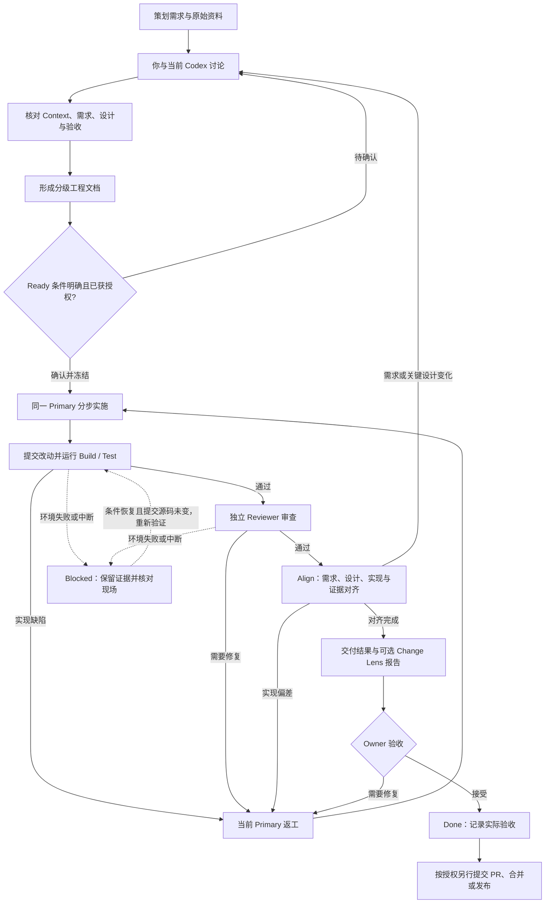

# Ares AI Engineering Harness

**从策划需求到可验收的代码交付：你与 Codex 直接讨论，以工程文档明确约定，以测试和独立审查验证实现，以可追溯记录完成交付。**

Ares 将 **Workflow-SOP、工程工作流 Harness 和 Change Lens** 组织在一个仓库中。当前 Codex 负责理解、讨论与实施；Harness 管理约定、检查、证据和验收；Web 按需展示进展与结果。

日常使用从一段需求和一次 Codex 对话开始。讨论形成有来源的上下文、需求、设计和验证方案；你确认后，当前 Codex 按约定推进开发。出现缺陷便带着测试或审查证据返工，最终交付代码、文档以及能够解释“为什么可以验收”的记录。

## 目录

- [项目组成与分工](#项目组成与分工)
- [完整工作流](#完整工作流)
- [讨论与开发会留下什么](#讨论与开发会留下什么)
- [一个需求如何走完流程](#一个需求如何走完流程)
- [文档等级与检查强度](#文档等级与检查强度)
- [Web 与 Change Lens 能看到什么](#web-与-change-lens-能看到什么)
- [快速开始](#快速开始)
- [GitHub 上如何交付](#github-上如何交付)
- [验证与当前边界](#验证与当前边界)
- [仓库结构与进一步阅读](#仓库结构与进一步阅读)
- [维护支持与许可](#维护支持与许可)

## 项目组成与分工

| 组成 | 回答的问题 | 在本项目中的职责 |
|---|---|---|
| **Workflow-SOP** | 需求应该如何讨论、设计、验证和交付？ | 提供分级文档、工程方法、模板、案例和对齐规则 |
| **Ares Harness** | 现在处于哪一步，进入下一步需要哪些条件？ | 保存任务与冻结约定，运行验证，校验证据，记录返工、恢复和 Owner 决定 |
| **当前 Codex Primary** | 如何理解并实现这项需求？ | 直接与你讨论，核对项目事实，整理文档，使用原生工具实施和返工 |
| **独立 Codex Reviewer** | 实现是否满足需求，是否存在遗漏或风险？ | 在 STANDARD/CRITICAL 中只读检查要求、改动和证据，给出独立发现 |
| **Web Observer** | 工作到了哪里，依据和结果在哪里？ | 展示任务阶段、文档、运行历史、检查、对齐和变化报告 |
| **Change Lens** | 代码发生了什么变化，可能影响哪里？ | 读取变更快照，生成分析与解释报告，保留分析范围和限制 |

这里的 **Owner 就是提出需求、确认关键决定和验收结果的你**。Primary 是你正在使用的原生 Codex 对话；在这条 Direct 流程中，Harness 不启动或续接一个替代 Primary。Reviewer 使用独立的原生执行上下文。

SOP 中的调研、上下文整理和方案规划由当前 Primary 完成。Ready 后继续由它实施，不再重新派发 Grounding/Planner Agent。外部 `ares-ai-software-engineering` 知识仓库按你的明确要求手动参考，当前流程不自动加载。

## 完整工作流

下面以 **STANDARD** 为主线。FAST 省略独立 Reviewer；CRITICAL 在实施前增加对冻结写入边界的明确授权。具体差异见 [文档等级与检查强度](#文档等级与检查强度)。



图中展示的是业务流程。**Web 可在任意阶段按需打开；它不参与对话转发，也不是推进任务的前置条件。** GitHub PR 可以在开发期间准备，合并与发布各自遵循实际授权。

### 1. 接收需求，先建立可靠的上下文

你提供策划需求、目标项目和允许处理的范围。Codex 先读取相关项目规则、代码、配置和已有资料，整理当前行为、约束与未知项，再与你讨论。

Context 记录“观察到了什么”和“依据在哪里”；需求文档记录“希望变成什么”。相关成熟案例与现有 SOP 按需参考，并写明采用理由与适用范围。尚未确认的产品规则保留为问题，不能被默认当成已经确定的需求。

### 2. 讨论形成文档，确认后冻结 Ready

当前 Primary 根据任务复杂度整理 TASK、SPEC 或 PRD/SDD/TEST-PLAN，将讨论中的有效结论写入文件。文档生成器承载共同结构，具体领域规则仍需 Codex 按适用模板补充完整。

Ready 冻结以下六项内容，并关联文档版本、项目策略、源码基线和你的实际授权：

| 冻结内容 | 需要说清什么 |
|---|---|
| Goal | 要解决的问题与预期结果 |
| Acceptance | 可观察、可验证的验收条件 |
| Non-goals | 本轮明确不处理的事项 |
| Boundary | 允许修改的项目范围与约束 |
| Key Decisions | 已确认的方案、关键取舍及理由 |
| Verification | 构建、测试、审查与人工验证安排 |

当前 CLI 使用 `document → agree` 记录文档和约定。Codex 从已登记的文档中读取冻结内容，你无需再到 Web 填一遍需求。未解决的关键问题会阻止 Ready；准备好文档本身不等于获得实施授权。

### 3. 同一 Primary 按可验证的增量实施

你确认实施后，当前 Codex 调用 `begin`，按设计拆出的行为增量使用原生搜索、编辑、Shell 和沙箱能力开发。核心规则与缺陷修复优先采用 Red → Green → Refactor；不适合测试先行时记录替代验证方式。

Primary 负责更新实际改动和必要决定。Harness 保存业务进度与边界检查，不采集每一次原生工具调用；“正在实施”是报告的里程碑，不是对所有外部编辑动作的实时监控。

### 4. 提交后运行测试与独立审查

`submit` 记录改动说明和当前源码指纹；`verify` 运行项目配置的 Build/Test。STANDARD/CRITICAL 还调用独立只读 Reviewer，将需求、实现和证据一起检查。

测试诊断或 Reviewer 发现需要修复的问题时，结果返回当前 Primary。它按原约定修复，重新提交并验证。每次 `verify` 都产生新的 Run，之前的失败和返工记录保留。

环境失败进入 Blocked。恢复时先核对源码与残留进程：提交源码未变可重新验证；发生修改则重新提交。硬崩溃后的 `recover` 用于记录核对与恢复决定，不承诺透明恢复原生会话。

### 5. Align：把“做完了”变成可核对的交付

检查通过后，Primary 逐条核对验收条件，将 AC 与当前 Run 的构建/测试证据关联，说明设计一致性、已处理偏移、清理和遗留。人工验收项需要真实 Owner 确认。

Harness 检查证据是否属于当前成功运行、文档和源码是否仍匹配、原始验证文件是否改变。它验证归属与完整性；验收语义仍由 Primary 如实解释，并接受 Reviewer 和 Owner 的判断。

实现偏差进入返工；需求、边界或关键设计变化先重新讨论，再生成文档版本和约定。文档不能被悄悄修改后继续沿用旧授权。

### 6. 你验收，记录完成；需要时再走 GitHub 交付

你查看实际成果、验收项、验证与审查摘要、限制和必要的变化报告。只有实际接受后，Codex 才通过 `accept` 将任务记为 Done。通过测试、完成 Align、批准风险边界都不代替最终验收。

需要仓库交付时，Codex 将安全摘要整理到 Issue/PR，经相应检查和明确授权后合并。**实施授权、业务验收、GitHub 合并授权分别留痕。**

## 讨论与开发会留下什么

### 人可以阅读的工程文档

| 等级 | 讨论与 Ready 阶段 | 交付阶段 | 常见适用范围 |
|---|---|---|---|
| **L1** | `TASK.md` | 在同一 TASK 追加交付与 Align | 小改动、局部缺陷、明确的文档修正 |
| **L2** | `SPEC.md` | 在同一 SPEC 追加交付与 Align | 一个可独立验证的完整功能 |
| **L3** | `PRD.md`、`SDD.md`、`TEST-PLAN.md` | `DELIVERY.md` | 跨系统、公共契约、迁移或复杂功能 |

重大、长期或难逆的决定才另写 ADR，按相关模板维护；CLI 不会为每个任务自动生成 ADR。小任务不强制拆出完整 L3 文档包。

讨论形成的文档包含原始需求来源/版本、Context 事实与依据、目标和验收、非目标与边界、设计与决定、可验证实施增量、验证方案和待确认项。**Context 会被考虑并留痕，但当前不会自动额外生成一份 `CONTEXT.md`，也不会自动导出完整聊天记录。**

### 机器保存的约定与执行证据

| 记录 | 何时形成 | 能回答什么 |
|---|---|---|
| Task 与阶段记录 | 建任务及后续业务操作 | 谁在处理、现在到哪一步、有哪些历史事件 |
| 文档版本与冻结 Agreement | `document` / `agree` | 当时确认了什么、依据哪版文档、允许改哪里 |
| 源码基线、提交指纹与 Diff | Ready / `submit` / `verify` | 验证针对哪份源码，与什么基线比较 |
| Run 与构建/测试输出 | 每次 `verify` | 执行了哪些命令、成功或失败的实际依据 |
| Reviewer 输出 | STANDARD/CRITICAL 验证 | 独立审查看到了什么问题，审查范围是什么 |
| 返工、Blocked 与恢复记录 | 故障或反馈发生时 | 为什么没完成，修复或恢复后做了什么 |
| Align 与实际 Owner 决定 | 对齐、授权、验收时 | 每条 AC 如何对应当前证据，谁确认了结果 |
| Change Lens 附件 | 可选 `lens` | 变更解释、分析范围和 `PARTIAL` / `FAILED` 状态 |

约定、状态和决定保存在现有 SQLite 业务记录中；它们不都对应独立 Markdown 文件。下面展示实际存储结构的示意，具体目录由本地配置决定：

```text
<DocumentsRoot>/
└── TASK-<task-id>/
    └── v<version>-<id>/
        └── SPEC.md                  # L2；L1/L3 使用上表对应文件

<DataRoot>/
├── ares-workbench.db                # Task、约定、Run、事件与决定
└── artifacts/<run-id>/
    ├── ...                         # Diff、构建/测试与审查原始输出
    └── lens/<attempt-id>/           # 可选
        ├── change-analysis.json
        ├── change-story.json
        └── change-story.html

<ScratchRoot>/                       # 任务缓存、构建与临时输出
```

文档新版本使用新目录保存，冻结约定保留当时文本。L1/L2 的交付对齐追加到对应版本的原文档；重复核对仍保留业务历史。原始过程证据留在授权的本地目录，GitHub 只接收允许提交的工程内容与安全摘要。

## 一个需求如何走完流程

以下是说明流程的简化示例，不代表本次已经执行了一项业务任务。

> 策划需求：标签内容为空时显示默认文案，已有有效文案的处理行为保持不变。

| 步骤 | 你与 Codex 实际做什么 | 对应留痕 |
|---|---|---|
| 讨论 | Codex 检查现有标签规则，与你确认 null、空串、纯空白和无效默认值如何处理 | 来源、Context、待确认问题与决定 |
| 明确需求 | 将“空输入使用默认值”“有效输入优先”“保留现有异常规则”写为可验证 AC | L2 `SPEC.md`、AC-01/02/03 和验证方案 |
| Ready | 你确认范围与方案，Codex 登记文档并冻结约定 | 文档版本、Agreement、实际授权 |
| 实施 | 当前 Primary 增加边界测试并实现选择逻辑 | 项目代码与测试改动、提交说明 |
| 验证与返工 | 空白输入测试失败时，Primary 按诊断修复；重验后独立 Reviewer 核对规则 | 首次失败、修复后的 Run、Reviewer 结论 |
| Align | 将每条 AC 对应到当前通过的证据，说明设计和实现是否一致 | SPEC 内的交付对齐段落 |
| 验收 | 你检查结果与限制后明确接受 | 真实验收决定，Task 为 Done |
| GitHub | 如需纳入仓库，整理 PR 与检查结果；按对应授权合并 | PR、CI、合并提交及回滚依据 |

你始终在原来的 Codex 对话中提供需求、回答关键问题和确认结果；Codex 负责把这些内容整理为工程记录。需要查看进度时，再让 Codex 打开只读 Web。

## 文档等级与检查强度

文档等级决定**需要把问题写到什么深度**；检查强度决定**实施前后需要哪些验证与决定**。两者独立选择，例如 L2 功能可以因风险不同采用 STANDARD 或 CRITICAL。

| 工作流 | 实施前条件 | 提交后检查 | 完成条件 |
|---|---|---|---|
| **FAST** | 文档、Ready 与实际实施授权 | Build/Test，不启动 Reviewer | Align + 实际 Owner 验收 |
| **STANDARD** | 文档、Ready 与实际实施授权 | Build/Test + 独立只读 Reviewer | Align + 实际 Owner 验收 |
| **CRITICAL** | 上述条件，加冻结写入边界的明确风险授权 | Build/Test + 独立只读 Reviewer | Align + 实际 Owner 验收 |

SOP 中的 **Build** 是适用任务的设计确认；CLI 中的 `build` 是编译检查。设计确认、编译成功、测试通过和最终验收各有不同依据。

## Web 与 Change Lens 能看到什么

**Web 是工作流观察入口。** 它读取与 CLI 相同的任务数据，展示阶段、讨论文档、约定、检查/审查、返工历史、Align、实际决定及附件。关闭 Web 不停止独立运行的 CLI，也不影响你继续与 Primary 对话。

**Change Lens 是可选的变化解释。** 当前集成围绕 C# / Unity 分析路径，将冻结 Git HEAD 到提交 WORKTREE 的变化生成 JSON 与 HTML 报告。它可能包含 Ready 前已有的未提交修改，报告明确比较范围。缺少严格历史编译基线时保留失败；显式允许语法级部分分析时保留 `PARTIAL`。

报告中的建议验证步骤不等于已经执行的测试。Web 展示的是登记的里程碑与检查快照，不是全部原生进程和工具调用的实时遥测。更多观察内容以后按实际需要接入，当前不假设存在额外插件平台。

## 快速开始

### 环境要求

| 组件 | 要求与用途 |
|---|---|
| Windows / PowerShell 7 | 当前本地运行与脚本入口 |
| Git / .NET SDK 10 | 项目基线、Harness 构建与测试 |
| 官方 Codex CLI | 已配置原生认证与沙箱；既有原生验证使用 0.153.4 |
| Python 3.11+ | 可选 Change Lens；统一检查另需 jsonschema 和 PyYAML |

当前 Windows 宿主将运行输出限制在授权的 `D:/AgentWorkspace` 目录。目标项目与过程输出分开配置；商业项目仅在获得相应授权后修改或执行。

### 1. 配置本地路径

将 [workbench.example.json](scripts/workbench.example.json) 复制到仓库外的本地配置文件，填写绝对路径，保持 `ObserverOnly: true`。

| 配置 | 用途 |
|---|---|
| `DataRoot` | SQLite 和原始运行证据 |
| `DocumentsRoot` | 任务工程文档及版本目录 |
| `ScratchRoot` | 缓存、构建和临时输出 |
| `CodexHome` | 现有原生 CLI 配置与认证目录 |
| `CodexExecutable` / `DotnetExecutable` / `GitExecutable` | 本机已有可执行文件 |
| `PythonExecutable` / `ChangeLensRoot` / `ChangeLensWorker` | 可选分析器运行与外部 Worker 路径 |

完整配置说明见 [统一流程](docs/UNIFIED_WORKFLOW.md#一次性配置)。凭证与本地配置不提交到 Git。

### 2. 构建 CLI，并从当前 Codex 发起任务

从仓库根执行：

```powershell
./scripts/Ares.ps1 -SettingsFile '<absolute-local-settings.json>' -Operation projects -Build
```

该命令构建命令入口并列出已登记项目。首次使用由 Codex 通过 `project` 登记目标仓库、允许路径、指令文件和实际 Build/Test 命令，再 `create` 创建任务。

可以向当前 Codex 提供这样的任务说明：

```text
使用这个仓库的 Ares 流程处理以下需求。
目标项目：<已授权项目路径>
需求来源：<策划资料及版本>
允许范围：<本轮可修改的内容>
先读取现状并与我讨论，整理相应等级的文档。
确认后按约定实施、测试、独立审查和 Align，最后交给我验收。
```

这个示例只表达讨论起点，具体实施边界和后续授权以实际对话为准。Codex 根据讨论生成请求 JSON 并调用 `document → agree → begin → submit → verify → align → accept`；返工和可选分析按前文分支执行。Owner 无需手写这些请求。字段与返回码见 [CLI 参考](docs/CODEX_DIRECT.md)。

### 3. 按需打开 Web 或启用变化解释

```powershell
./scripts/Start-Workbench.ps1 -SettingsFile '<absolute-local-settings.json>' -Port 5271
```

打开 `http://127.0.0.1:5271/Observe`。脚本前台运行，Ctrl+C 停止 Web。Agent 后台启动时使用隐藏进程，并将日志保存到任务目录。

需要 Change Lens 时，先配置上表三个分析器字段；`ChangeLensWorker` 指向 `ScratchRoot/lens-build/bin/ChangeLens.Analyzer/release/ChangeLens.Analyzer.dll`，再构建：

```powershell
./scripts/Ares.ps1 -SettingsFile '<absolute-local-settings.json>' -Operation projects -Build -BuildLens
```

Codex 在适用任务的待验收阶段调用 `lens`，传入 `UnityPath`、`Assembly` 及明确选择的部分分析策略。

## GitHub 上如何交付

| GitHub 内容 | 保存什么 |
|---|---|
| Issue | 安全的需求来源、目标、边界、AC、Task ID、文档引用及待确认项 |
| 分支与提交 | 实际代码、配置及允许纳入仓库的工程文档 |
| Pull Request | 最终行为、冻结范围、验证与审查 revision、AC 证据摘要、Align、限制和回滚方式 |
| Actions / 合并记录 | 对应提交的 CI 结果、实际合并及关联任务关闭 |

Codex 从直接对话维护这些记录。原始商业资料、认证、SQLite、artifacts/evidence 和运行配置保留在本地。GitHub 记录不替代本地原始证据，也不把本机路径当作他人可访问的附件。

PR 检查通过、阻断问题解决并获得本次明确授权后才合并；不会因 Task Done 自动发布版本。规范和模板见 [CONTRIBUTING](CONTRIBUTING.md)、[GitHub 工作流](docs/GITHUB_WORKFLOW.md) 与 [PR 模板](.github/pull_request_template.md)。

## 验证与当前边界

### 验证 Harness 本身

以下命令检查本仓库实现；业务任务的 `verify` 使用其登记的项目 Build/Test 命令，两者用途不同。

```powershell
./scripts/Test-Unified.ps1 -ScratchRoot '<absolute-task-scratch>' -EvidenceRoot '<absolute-task-evidence>' -InstallTestDependencies
```

统一入口运行 Harness 构建/测试、SOP 文档检查、Roslyn Worker 构建和 Change Lens 测试；依赖与过程输出写入指定外部目录。远程实际结果见 [GitHub Actions](https://github.com/YIMO691/ares-ai-engineering-harness/actions/workflows/build.yml)。

### 当前实现范围

当前主线为 **Codex Direct + Observer**，SOP 与 Change Lens 按固定版本导入。`v0.2.0` 和旧 Web Fusion 保留为历史基线与兼容路径；新任务按本文流程使用。

- 当前是单用户本地工具，不提供公开的多租户服务；原生会话、搜索、编辑、Shell 与沙箱由 Codex 管理。
- CLI 按业务操作推进，原生 Primary 的工具顺序依靠当前 Codex 遵循 SOP；Harness 不自动接管外部对话或长期后台实施。
- 文档生成器提供共同结构；来源充分性、领域设计和验收语义仍需实际讨论、检查与判断。
- 原生完整聊天不会自动归档；硬中断不承诺无损续接。每次验证保留新的 Run 与对应证据。
- Change Lens 支持范围及部分分析限制见 [组件说明](tools/change-lens/README.md)。控制替身测试、语法级样例和真实项目验收分别记录。
- 没有将工具测试通过等同于生产项目验收，也未据此声明正向 ROI。历史材料的范围见 [文档导航](docs/README.md)。

## 仓库结构与进一步阅读

```text
.
├── AGENTS.md              # 当前 Codex 的仓库入口
├── README.md              # 项目全貌、完整流程与启动
├── WORKFLOW.md            # 阶段和恢复规则速查
├── CONTRIBUTING.md        # 贡献与 PR 要求
├── .github/               # Issue Forms、PR 模板与 CI
├── workflow/              # 固定版本 SOP、模板、案例和 Ares 适配
├── src/                   # Domain、Application、适配器、CLI 与 Web
├── tests/                 # Harness 验证
├── scripts/               # 配置、启动与统一检查入口
├── tools/change-lens/     # 变化分析器与报告组件
└── docs/                  # 使用参考、架构、决策与历史
```

| 想了解 | 阅读 |
|---|---|
| 文档字段、版本与 Align 请求 | [统一流程](docs/UNIFIED_WORKFLOW.md) |
| CLI 操作、返回码与恢复 | [Codex Direct 参考](docs/CODEX_DIRECT.md) |
| SOP 方法与模板如何应用 | [ARES_PROFILE](workflow/ARES_PROFILE.md) · [AI-PLAYBOOK](workflow/AI-PLAYBOOK.md) |
| 组件与权限责任边界 | [当前架构](docs/architecture/ARCHITECTURE.md) · [安全说明](SECURITY.md) |
| 固定导入版本及本地适配 | [导入清单](docs/integrations/UPSTREAM_IMPORTS.json) · [适配说明](docs/integrations/LOCAL_ADAPTATIONS.md) |
| 当前说明与历史设计如何区分 | [文档导航](docs/README.md) |

## 维护支持与许可

项目由 [YIMO691](https://github.com/YIMO691) 维护，仓库保持私有。使用问题与安全摘要可通过 [Issue 模板](https://github.com/YIMO691/ares-ai-engineering-harness/issues/new/choose) 反馈；安全问题按 [SECURITY.md](SECURITY.md) 私下报告。更多说明见 [SUPPORT.md](SUPPORT.md)。

主项目尚未选择开源许可证。导入 Change Lens 保留原 [MIT LICENSE](tools/change-lens/LICENSE)，来源和适配记录随仓库保留；仓库规范化不改变已有许可和数据边界。
