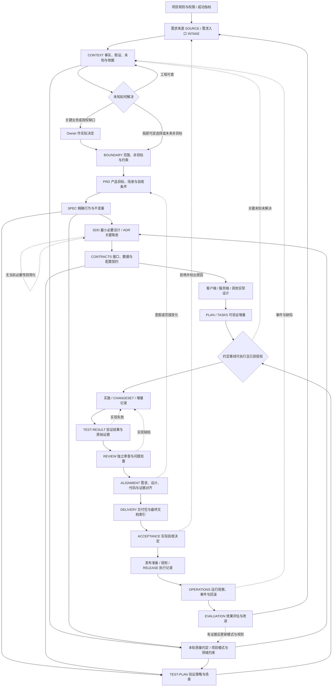

# 最终 Harness：自主工程、代码质量与持续改进

本文是 Ares 的**目标参考架构 v2**，更新日期：2026-09-16。最终目的是：让 Owner 主要表达需求、作关键决策和验收，由原生 AI 自主完成大部分工程工作，交付有证据支持、符合项目且可长期维护的结果。本文统一描述需求理解、复杂度治理、代码质量、验证交付与持续改进；**目标设计不表示当前 CLI 已实现全部机制**。当前能力和实施顺序集中在第 11 节。

完整体系由三份文档组成：

| 阅读顺序 | 内容 |
|---|---|
| 本文 | 最终目标、端到端设计、质量机制、实施差距与演进计划 |
| [文档契约目录](target-harness/ARTIFACT_CONTRACTS.md) | 每种产物的输入、最小语义内容、责任、完成条件和后续消费者 |
| [完整贯穿示例](target-harness/WALKTHROUGH.md) | 一个虚构需求怎样经过全部环节，以及失败、需求变更和中断怎样处理 |

当前操作以[现行研发流程](UNIFIED_WORKFLOW.md)和 [CLI 参考](CODEX_DIRECT.md) 为准。目标架构保留完整职责；是否合并成少量文件、哪些职责不适用，在项目落地时另行决定。

## 1. 目标与边界

目标同时约束人的负担、交付可靠性和代码长期质量：Owner 不必穷举需求边界或反复搬运上下文；模型在授权内调查、设计、实现和返工；Harness 维护版本、权限、依赖、工具结果、证据归属、状态转换和实际决定。以质量、返工、维护成本、人的投入和总成本衡量成效，不以文档、规则或 Agent 数量衡量成熟度。

完整性由以下问题衡量，而非文件数量：

1. 为什么做，需求来自哪里，哪些仍是假设？
2. 当前系统是什么，允许改变什么，哪些行为必须保持？
3. 产品要什么，准确行为是什么，采用什么实现与接口约定？
4. 如何拆分并验证，每个结论依据哪个版本的事实？
5. 失败、变化、中断和交接后，怎样恢复并识别失效结论？
6. 谁决定可以实施、可以验收、可以合并或发布？
7. 最终交付什么，运行后如何发现问题并改进系统和 Harness？

理论覆盖产品、设计、实现、验证、交付、运行与改进。它不接管原生模型的推理、会话、搜索编辑循环或沙箱；不要求重建 Agent runtime；不把模型的自述当作测试或人的决定。

### 1.1 共同工作的五部分

| 部分 | 要解决的问题 | 输出如何进入下一步 |
|---|---|---|
| 需求理解与未知分流 | 什么必须由人决定，什么可由项目事实或局部工程判断解决 | 最小充分规格、已知事实、关键不变量、非目标与待决事项 |
| 工程控制 | 按哪个版本、范围和授权执行，变化后哪些结论失效 | 约定基线、依赖、状态、可恢复记录与真实决定 |
| 上下文与代码质量 | 怎样避免错误模式、重复状态、过度抽象和验证不足 | 按需 Context、经核验模式、本轮质量约定和适用检查 |
| 原生实现与可信交付 | 如何在真实环境完成改动并证明符合要求 | 代码、测试、工具结果、必要审查、对齐与交付 |
| 运行与效果改进 | 产品是否有效，辅助机制是否值得保留 | 运行反馈、真实评测、回归样本及规则晋升/退役决定 |

这是职责划分，不要求五个服务、五个 Agent 或独立仓库。代码质量方法描述生成与判断要求，Analyzer/validator 独立执行确定性检查，Harness 记录约定与结果；不新建模型推理、检索、会话或编辑 runtime。

## 2. 全链路总图

箭头表示信息依赖，不表示每一格都要独立开会、审批或生成文件。测试设计、接口设计和实施规划可以相互反馈；ADR、风险、变更和交接贯穿全程。

发布准备、运维设计和回滚方案应在设计与验证时准备，图中 RELEASE 指实际执行。无部署行为的任务可在交付中说明这一点，不能制造发布成功记录。

还有四条横向链：

- **追溯链**：来源 → 需求/AC → 行为规则 → 设计/接口 → 改动 → 测试 → 结果 → 审查 → 对齐 → 验收 → 发布版本。
- **变更链**：问题或新事实 → 影响分析 → 决定 → 新基线 → 受影响项失效 → 重做或重验。
- **持续执行链**：任务状态 → 已完成增量 → 检查点 → 阻塞/交接 → 现场核对 → 恢复。
- **质量链**：项目事实与适用模式 → 本轮质量约定 → 最小必要设计 → 确定性检查与语义审查 → 运行反馈/可重放样本 → 效果评价 → 模式与规则晋升、降级或退役。

## 3. 每一阶段怎样进入、完成和退回

表中是目标阶段契约，**不是新增 CLI 状态枚举**。每项产物的内容契约见[目录](target-harness/ARTIFACT_CONTRACTS.md)。Owner 可以在一次自然讨论中确认多项意图，Harness 记录已发生的决定，不重复索要同一授权。

| 阶段 | 必要输入 → 产物 | 完成条件 | 主要责任 / 不满足时 |
|---|---|---|---|
| 受理 | 请求、已有规则 → SOURCE、INTAKE | 来源可定位；目标和需求负责人明确；矛盾与未知已登记 | Primary 整理；Owner 澄清业务意图 |
| 建立上下文 | 来源、当前系统 → CONTEXT | 关键事实有版本依据；事实、推断和假设分开；关键未知有处理路径 | Primary 核实；无法访问则保留缺口 |
| 界定范围 | Context、意图、权限 → BOUNDARY、风险项 | in/out、必须保持的行为、写入范围和授权来源明确 | Owner 决定业务取舍；超范围返回讨论 |
| 产品定义 | 来源、边界 → PRD、稳定 AC | 用户、场景、价值、优先级和可观察结果一致；不虚构产品决定 | Primary 编写；Owner 解决冲突 |
| 行为规格 | PRD、当前行为 → SPEC | 输入输出、状态、不变量、异常与并发行为足以独立判定对错 | Primary 提议；歧义返回产品定义 |
| 工程设计 | SPEC、技术约束 → SDD、CONTRACTS、详细设计、ADR | 关键规则有实现归属；兼容、数据、失败恢复和非功能目标有方案 | Primary 设计；必要时先做有边界的试验 |
| 规划验证 | 规格和设计 → PLAN/TASKS、TEST-PLAN | 增量可独立核验；AC 有方法与预期；环境/数据依赖和缺口明确 | Primary 规划；不可验证则修订规格或准备环境 |
| 约定基线 | 上述有效版本、项目策略、源码基线 → BASELINE | 关键未知已解决；允许实施的意图、范围、检查和授权可追溯 | Harness 核验记录；Owner 作实际决定 |
| 实施 | 基线、Context 包 → CHANGESET、进度和必要决定 | 每个增量有实际改动及自检；范围变化没有被静默吸收 | 原生 Primary 执行；缺陷返工，范围变化重开约定 |
| 验证 | 改动版本、TEST-PLAN → TEST-RESULT、EVIDENCE | 记录实际执行、结果与限制；必需检查满足所选策略 | 工具产证据，Primary 解释；失败返工或阻塞 |
| 审查 | 规格、改动、证据 → REVIEW | 审查范围和版本明确；阻断发现闭合；未知没有冒充通过 | 独立只读 Reviewer；Primary 修复后复核 |
| 对齐 | 全链与当前版本 → ALIGNMENT | AC 证据有效；设计/实现偏移有处置；文档与交付版本相符 | Primary 整理，Harness 校验关联；按原因回退 |
| 交付 | 对齐结果、可交付版本 → DELIVERY、最终索引 | 接收者能找到、理解、使用和验证交付物；限制与回滚清楚 | Primary 交付；不可访问的证据先解决可用性 |
| 验收 | 交付版本、AC、实际决定 → ACCEPTANCE | 验收主体、范围、版本与决定真实；拒绝/部分接受有后续归属 | Owner 或约定验收者；未经决定保持待验收 |
| 发布运行 | 交付基线、发布方案、环境授权 → RELEASE、OPERATIONS | 实际执行和健康检查可查；异常可止损；结果不能只靠“已部署”自述 | 获授权的执行者；失败按预案恢复并保留事件 |
| 评估改进 | 开发证据、运行反馈 → EVALUATION、新需求或回归样本 | 分清事实与因果假设；改进有目标、适用范围和验证方式 | 维护者决策；不把每次偶发问题变成永久门禁 |

### 3.1 用最小充分规格治理未知

规格应足以确定当前意图、可观察结果、关键不变量、硬约束、非目标和验收，不要求提前枚举所有假想边界。按语义影响、可逆性、影响范围、工程可查性和可验证性分流未知，不使用未经校准的统一风险分数：

| 情况 | 处理与留痕 |
|---|---|
| 代码、配置、测试或权威资料可回答 | Primary 自行调查，记录事实与来源；冲突仍需解释 |
| 授权范围内的局部可逆实现选择 | Primary 使用简单合理方案；重要假设有验证和失效条件 |
| 未确认的未来可能性 | 归入非目标或后续候选，不提前建设支持框架 |
| 会改变业务含义、公共契约、数据、安全或不可逆状态，且无既有决定 | 只询问影响当前取舍的关键问题，说明选项及影响；不擅自补决定 |

不确定性可以受控保留，依赖它的高影响承诺不能先发生。现行 `agree` 对未决项的要求仍有效，不能以“自主决定”为由删除实际阻断问题。属性、不变量、反例和故障验证帮助发现遗漏；机械验证不能替代缺失的业务意图。

### 3.2 设计与 Harness 都要说明复杂度的必要性

新增通用抽象、依赖、跨模块状态、配置维度或显著扩大的变更面，应说明当前问题、适用实例、更简单的方案及其不足。接口、策略或工厂本身不是错误，文件数和行数也不是统一质量门槛。只有“以后也许会用到”时先保留演化空间，推迟实现。

这一原则同时约束产品实现与 Harness：新增 schema、审批、报告、Agent 或规则需要对应反复出现且代价明确的问题。最小设计不等于省略恢复、权限、生命周期或当前已知风险；高风险任务按真实需要补齐。

## 4. 全部产物与“最终文档”

文档角色是信息职责，文件是载体。同一文件可承载多个角色；一个角色也可由正文、结构化契约和外部证据共同构成。**先把下列角色全部定义清楚，再做项目适配。**

| 类别 | 完整理论产物 | 主要用途 |
|---|---|---|
| 治理与受理 | PROJECT-POLICY、INTAKE、SOURCE | 规则、授权、来源、目标与成功标准 |
| 理解与产品 | CONTEXT、QUESTION/ASSUMPTION/RISK、BOUNDARY、PRD | 区分现状、未知、允许范围与希望实现的价值 |
| 规格与设计 | SPEC、SDD、CONTRACTS、CLIENT/SERVER/其他详细设计、ADR | 精确行为、实现责任、接口和关键取舍 |
| 执行准备 | PLAN/TASKS、TEST-PLAN、BASELINE、CONTEXT-PACK | 可验证增量、判据、冻结版本与模型工作输入 |
| 实施与验证 | CHANGESET、TEST-RESULT/EVIDENCE、REVIEW、ALIGNMENT | 真实改动、结果、问题闭合与可追溯对齐 |
| 交付与运行 | DELIVERY、ACCEPTANCE、RELEASE、OPERATIONS | 可用交付、真实决定、发布与运行责任 |
| 横向与改进 | CHANGE-REQUEST、STATUS/HANDOFF、EVALUATION | 变化控制、持续执行、恢复与效果评估 |

“最终文档”分三层，不能只交一份总结：

1. **持续维护的项目知识**：当前有效的 PRD/功能入口、SPEC、架构与详细设计、接口/数据/配置契约、ADR、用户或集成说明、测试资产、运维手册。代码变化后同步维护，并可回看旧版本。
2. **本次可交付基线**：DELIVERY 索引，引用准确的产品/技术文档版本、代码或构建产物、迁移与回滚方案、已知限制、AC 对齐、验收决定及发布记录。没有实际验收/发布时明确待完成。
3. **不可改写的过程与证据档案**：来源观察、冻结约定、变更决定、运行结果、失败与复验、审查处置、交接和评价。允许追加纠正记录，不将失败改写成成功。

最终索引必须告诉接收者：交付的是什么版本；从哪里读功能和技术说明；怎样使用、验证和恢复；哪些已接受、未验证或未发布；剩余事项由谁负责。原始日志、敏感材料和完整对话不因“完整”而一律复制进 Git。存储位置、访问权限、保留周期和对外可见摘要由项目策略规定。

## 5. 职责：Harness、模型、人和工具

| 责任 | 原生 Primary | Harness | Reviewer / 专门工具 | Owner / 领域负责人 |
|---|---|---|---|---|
| 意图与产品 | 发现歧义、提出方案、维护结论 | 记录来源、版本与决定 | 可检查冲突和可验证性 | 决定业务目标、取舍及授权 |
| Context | 检索事实、按任务选读、解释缺口 | 提供索引、版本/权限/新鲜度和工作包记录 | 读取真实来源，验证事实 | 补充不可从工程事实得出的信息 |
| 设计与实现 | 自主规划、编辑、运行、自检和返工 | 边界、基线、进度、反馈与历史 | 原生工具实际执行；契约检查定位问题 | 解决影响范围或业务的关键决定 |
| 验证与审查 | 提出判据、测试、解释结果和修复 | 运行既定检查，绑定版本和证据 | 工具返回结果；独立 Reviewer 检查语义 | 完成约定人工体验/业务检查 |
| 交付与发布 | 整理准确交付包，在授权内执行 | 校验完整性、状态、授权与历史 | 发布/观测工具报告实际状态 | 实际验收、合并或发布授权 |

模型的自主空间包括读哪些文件、如何拆解任务、普通实现选择、工具顺序、缺陷修复与授权范围内的必要重构。应升级给人的问题是缺失的业务意图、跨越授权边界或需要实际验收的决定；可从代码和现有授权解决的问题应先调查。

独立审查是一项完整理论职责，具体启用条件由实施策略选择；不是要求每个任务增加一个 Agent。当前 FAST 不启用 Reviewer，STANDARD/CRITICAL 保留现有独立只读 Reviewer。模型置信、自评或另一个模型的赞同不能替代实际工具结果和业务验收。

## 6. 信息权威、标识与版本

### 6.1 不同文档回答不同问题

- SOURCE 保留“需求方实际说了什么”；PRD 表达经确认的产品意图。冲突通过决定记录解决，不能静默重写来源。
- CONTEXT 表达观察到的现状；SPEC 表达期望行为。现有代码的行为不自动成为正确需求。
- SDD/CONTRACTS 表达实现约定；代码表达实际实现。两者冲突必须定位是文档滞后还是实现偏离。
- TEST-PLAN 表达验证预期；TEST-RESULT 表达实际观察。计划写了一个测试不等于它执行过。
- REVIEW 是有范围和依据的专业判断；ALIGNMENT 是关联与偏移处置；ACCEPTANCE 是实际人的决定。三个角色不能互相代签。

同一规则只指定一个权威定义，其他文档通过稳定标识引用。摘要用于定位与理解，不取代可访问的权威原文。

### 6.2 目标元数据契约

以下是目标逻辑模型，不是当前请求 JSON，也不是要求所有 Markdown 加 front matter。

| 元数据 | 语义 |
|---|---|
| `artifact_id` / `kind` | 不随文件重命名而变化的身份及文档角色 |
| `revision` / `status` | 不可混淆的修订与编辑状态 |
| `owner` / `recorded_by` / `observed_at` | 内容责任、实际记录者和观察时间 |
| `sources` | 原始来源、定位、观察版本和访问限制 |
| `depends_on` | 依赖的具体 artifact ID + revision + 相关条目 |
| `covers` | 所覆盖的需求、AC、规则、接口、风险或测试 ID |
| `baseline_id` / `task_id` | 所属任务及执行依据的冻结基线 |
| `evidence_refs` | Run、工具、环境、源码/产物版本、结果和原始证据定位 |
| `decisions` / `supersedes` | 实际决定及被替代的版本；保留历史 |
| `classification` / `access` / `retention` | 分享边界、可读对象和保留策略 |

持久 ID 示例为 `REQ-001`、`AC-001`、`RULE-001`、`API-001`、`INC-001`、`TC-001`、`FIND-001`。删除条目后保留退役映射；编号不重用；重排段落不改变身份。语义变化产生新修订并触发影响分析。

源码使用 commit 或等效内容指纹，脏工作区须表示实际内容；二进制用产物摘要。外部文档记录观察版本、摘录范围和许可内的快照/摘要；仅有 URL 或时间戳不足以保证内容未变。无法固定或重新访问时标为未核实，不伪造哈希。

### 6.3 编辑状态与证据新鲜度分开

目标文档编辑状态为草稿、待审、有效、已替代、已撤销。证据另记录 `PASS / FAIL / BLOCKED / NOT_RUN / NOT_APPLICABLE / INCONCLUSIVE` 等结果，并独立记录是否仍对当前基线有效。一个历史 PASS 可以是当前 STALE；不能将它改成从未执行。

“有效”表示已达到该文档的完成契约，不表示所有文档都经人工批准。授权/验收必须单独记录真实决定；`NOT_APPLICABLE` 需要适用性理由，`NOT_RUN` 不能自动视为通过。

## 7. 依赖、变化传播与恢复

目标 Harness 维护精确依赖图。上游变化先将依赖该内容的下游标记“待影响核对”；受影响部分置为 STALE，未受影响部分以可解释的影响分析重新确认。不得仅因文件哈希变化全盘重做，也不得直接继承旧通过结果。

| 变化 | 必须重新核对的链 | 返回位置 |
|---|---|---|
| 产品目标、AC 或范围变化 | PRD/SPEC → 设计/契约/计划 → 测试/结果/对齐/交付 | 讨论并形成新约定 |
| 当前事实或外部依赖变化 | 依赖该事实的规则、设计、风险与验证 | Context；涉及意图则讨论 |
| 接口、数据结构或兼容约定变化 | 生产者/消费者设计、兼容测试、迁移和回滚 | 工程设计；超边界则重开约定 |
| 冻结范围内的代码修复 | 受影响测试、审查、对齐及交付引用 | 实施与重新提交 |
| 测试环境、判据或测试代码变化 | 受影响结果和结论；判据不得为迁就实现静默放宽 | 验证设计或规格澄清 |
| 纯排版/链接修复 | 文档导航与受影响引用；记录为何不影响行为证据 | 文档维护 |
| 已验收/已发布版本发生变化 | 新版本差异、验证、验收适用范围与发布授权 | 新增变更记录；保留旧决定 |

CHANGE-REQUEST 记录触发者、原因、受影响 ID/修订、备选处理、实际决定、新基线和后续动作。实现缺陷沿原约定返工；不能把每次修复都变成重新定义需求。

中断时保留 STATUS/HANDOFF：最后确认基线、已完成增量、当前工作区差异、最近有效 Run、未决问题、已执行/未确认的外部副作用和下一步。恢复先检查真实现场与权限，再决定继续、重提交、重验或重开约定。网络超时后的发布、支付、写库等操作先查实际结果，避免盲目重放；需要时使用工具支持的幂等标识。这是业务恢复契约，不承诺透明恢复原生会话。

## 8. Context 如何真正服务模型

完整档案用于追溯；模型工作包用于当前任务。目标 CONTEXT-PACK 按本轮目标、阶段和风险选择信息，包含：

1. 当前目标、稳定 AC、非目标、授权边界和正在处理的增量。
2. 相关项目规则、系统地图与权威文档的精确版本和定位。
3. 需要直接提供的关键行为/接口约束，以及可继续按需读取的来源。
4. 事实、推断、假设、未知分别标记；尚未解决的问题及负责人。
5. 当前差异、历史失败、Reviewer 发现和仍有效的验证结果。
6. 可用工具、预期反馈、环境限制、预算与停止/升级条件。

工作包应记录包含与省略的范围、不可访问来源、摘要依据和更新时机。关键规则被截断或无法读取时必须可见；不以“已压缩”暗示完整覆盖。模型可按需读取原文，Harness 提供可检查的目录与依赖，避免一次塞入全部档案。

不可信的网页、日志、仓库注释和附件是待核实数据，其指令不能覆盖用户授权和项目规则。访问受限资料遵守原权限；不能为了追溯扩大发布范围。记录必要的可观察决定、工具调用结果和理由，不索取或归档模型隐藏思维链。

每个增量的反馈应指出：发生了什么、在哪个版本、预期与实际差异、相关规则/测试、原始证据在哪里、哪些已经尝试。模型据此修复；Harness 不预先编排每一步思考。

### 8.1 优秀模式、相似实现与反例

相似代码只能证明结构相近，不能自动成为 Golden Pattern。可推荐模式需要可核验来源及版本、为何适用、值得借鉴的工程决定、业务特例与不可照抄部分、禁止使用场景、验证/审查依据和重新核对条件。反例标明具体问题与替代路径，不把整个旧模块一概定为坏代码。

按目标、阶段和风险选择最少的相关事实与模式；先给索引，再按需读取原文。项目当前源码证明当前事实，确认的需求决定期望行为；共享知识不能覆盖这两者。框架升级、源码变更或反例出现时使相关模式待复核，不能靠一次“认可”永久有效。真实任务中的有效修复只有经过复核和适用性判断才进入共享模式库。

## 9. 从“有文档”到“有可信结论”

目标检查分三层，各自声明能力：

| 层次 | 可核验内容 | 不能据此声称 |
|---|---|---|
| 结构与权限 | 字段存在、路径合法、授权记录、引用类型 | 产品需求正确、实现满足要求 |
| 关联与新鲜度 | ID 可解析、依赖修订一致、结果属于本次源码/环境、问题有处置 | 一条 build 成功已覆盖所有 AC |
| 语义与效果 | 针对场景的断言/观察、独立审查、业务体验与运行指标 | 模型判断永远正确、未测路径无缺陷 |

理想追溯表的一行是：

`AC-001@r2 → RULE-001@r2 → API-001@r2 / DESIGN-001@r2 → CHANGE-001@rev-B → TC-001@r2 → RESULT-002(run-B, rev-B, env-B) → REVIEW-002 → ALIGN-002 → ACCEPT-002`

一项 AC 可对应多个测试；一个测试也可支持多个 AC，但必须说明断言与支持范围。构建成功证明可构建；测试进程退出 0 证明该命令成功；具体行为结论还需要场景、判据与实际观察。性能、安全、可访问性和兼容性同样需要明确环境、方法、阈值与限制。

人工验证记录实际执行者、时间、步骤、观察和证据。不能由 Primary 填一句“Owner 通过”代替真实验收。Reviewer 发现应有修复、经授权接受风险、撤销或不适用等明确处置与依据；阻断问题不能仅靠重写报告消失。

### 9.1 本轮质量约定

质量约定从当前 AC、项目事实、风险和可用验证能力中选择，不复制完整规范。它是 C01、C08、C13、C14、C18 等角色的关联语义，可以放进既有设计、验证和冻结摘要；不新增第 27 类必需文档，也不表示当前 CLI 有 `QualityContract` 字段。

| 内容 | 本轮需要说明什么 |
|---|---|
| 必须满足的条件 | 正确性、权限、兼容等不可被其他优点抵消的要求，以及实际判定方法 |
| 核心质量关注点 | 按需选择可理解性、局部性/模块化、必要复杂度、可验证性、可演化性、项目适配 |
| 领域与风险约束 | 涉及本轮的并发、生命周期、可靠性、安全、性能等；不全量启用 |
| 项目适配 | 现有状态 owner、依赖方向、生成来源、适用模式及不能复制的部分 |
| 证据要求 | 哪个命令、断言、运行观察或人工检查支持哪个结论，缺口是什么 |
| 审查与整理范围 | 检查强度、语义审查重点、允许重构范围和停止/升级条件 |

正确性与质量判断分别给出依据，不合成一个可互相抵消的总分。质量整理应保持行为并留在约定范围，不能借机进行无关重构。需求、项目事实或规则版本变化后复核质量约定；冻结后的实质变化走现有变更机制。

### 9.2 领域规则先校准

| 领域 | 重点调查与验证 | 证据边界 |
|---|---|---|
| 游戏客户端 | 请求与界面生命周期、资源释放、事件订阅、取消/销毁后回调、热路径分配 | 生命周期场景和性能观察不能仅用编译通过代替 |
| 游戏服务端 | 权威来源、幂等、并发、事务/持久化失败、重试和恢复 | 重复请求和失败注入需要真实可检查结果 |
| ET6 / 共享生成链 | 实际 ETTask 使用、跨 await 实体有效性、状态归属、程序集边界、配置/协议生成来源 | ET10 资料和历史 ET6 资料都不能直接定义目标 fork 的当前规则 |

先确认项目版本、实际工具和源码证据，再选择适用 profile。领域假设未校准时只能作为调查/审查提示，不能直接成为构建错误。

### 9.3 确定性检查、风险信号与语义判断

| 类型 | 适合的处理 | 不能推导的结论 |
|---|---|---|
| 可确定判定 | 编译器、测试、语义 Analyzer、架构/配置/协议校验、生成来源检查 | 工具执行成功不证明所有业务场景充分覆盖 |
| 只能提示风险 | 跨 await 生命周期、热路径分配、异常变更面等先作为观察或 warning | 命中信号不自动等于违规；未命中不证明安全 |
| 需要语义判断 | 抽象是否必要、状态 owner 是否合理、代码是否清晰且符合项目 | 指标阈值和模型自评分不替代有证据的判断 |

规则按 PROPOSED → OBSERVE → WARNING → GATE → DEPRECATED 管理，允许根据证据回退。记录稳定 ID、意图、适用项目/版本、工具、成熟度、维护者、正反例、误报、例外和修复办法。机械门禁晋升需要可靠判定与兼容性证据；已有债务可基线化并控制新增，例外须有原因、适用范围和复核条件。

诊断应给出规则 ID、源码位置、观察/预期、修复方向与原始证据。Analyzer 和 validator 独立运行，Harness 关联结果与本次基线，不复制它们的执行引擎。修复后的有效发现可成为规则或回归样本；不是每次失败都自动生成永久门禁。

## 10. 完整性覆盖面

以下关注点都在目标体系有归属；具体项目是否适用，需要给出依据。功能详设不能成为全部工程问题的替代品。

| 关注点 | 主要落点 | 验证/交付闭合 |
|---|---|---|
| 用户流程、UI 状态、文案、体验和可访问性 | PRD、SPEC、客户端/交互设计 | 场景验证、体验检查、使用说明 |
| 规则、边界、状态、重复与并发 | SPEC、CONTRACTS、服务端设计 | 单元/集成/端到端、负例与不变量 |
| 数据生命周期、隐私、权限与威胁 | BOUNDARY、SDD、数据契约、风险项 | 权限/数据验证、保留与删除策略 |
| 性能、容量、可用性和成本 | PRD 非功能目标、SPEC 判据、SDD | 可复现实验、容量限制与运行指标 |
| 外部依赖、协议、旧数据与版本兼容 | Context、CONTRACTS、ADR | 契约测试、兼容矩阵、迁移演练 |
| 可观测性、运维、容灾和回滚 | SDD、TEST-PLAN、发布计划/运行手册 | 健康检查、告警归属、恢复验证 |
| 供应链、构建、制品和配置 | PROJECT-POLICY、PLAN、CHANGESET | 依赖与制品来源、构建记录、环境差异 |
| 合规或领域专门要求 | 来源、边界、适用性分析、专门设计 | 所需专业复核与证据；不宣称自动合规 |
| 文档、接口与代码长期一致性 | 依赖图、ALIGNMENT、最终索引 | 版本更新、失效提示、运行反馈 |

## 11. 当前实现映射与演进次序

截至本设计版本，当前实现是一部分基础设施。下表以源码和现行文档为依据，不把本次补充当作功能实现。

| 目标能力 | 当前支持 | 待补齐部分 |
|---|---|---|
| Source、Context、边界、意图 | `EngineeringBrief`、六项 Ready anchors 和冻结约定已存在 | 独立语义契约、外部来源版本核验与关键未知管理 |
| 文档载体 | L1 TASK；L2 SPEC；L3 PRD/SDD/TEST-PLAN，交付时 DELIVERY | 完整角色目录；**当前 L3 没有独立行为 SPEC**；不能按文件名推断职责已齐全 |
| 项目长期文档 | 功能入口、客户端、服务端、验证四类模板及引用规则 | 可表达全部目标角色的项目适配表及依赖关系 |
| 基线与证据 | DocumentSet 修订/文件哈希、项目/源码指纹、Run 与归属检查 | 跨项目文档、接口、测试场景的稳定 ID 和细粒度失效图 |
| 模型 Context | Primary 原生读取；Reviewer 收到约定、差异及部分文档内容 | 有权限/版本/遗漏声明的 Context 包；当前长文本摘录不保证关键内容完整 |
| 验证与对齐 | 配置 Build/Test、独立 Reviewer；Align 使用 AC 序号和运行证据 | 场景断言级映射、跨修订稳定 AC、语义支持范围核验 |
| 决定与恢复 | 真实授权/验收、返工、阻塞和现场恢复记录 | 细化变更影响与结构化交接；不新增自定义原生会话 runtime |
| 发布与运行 | GitHub 交付规范；Done 不自动发布 | 发布/观测/事件/回滚的目标文档链和相应集成 |
| 需求与复杂度治理 | 现行流程有人工维护的未知分流与复杂度自检方法 | 可评估的决策记录与反馈；没有自动歧义分类/复杂度门禁 |
| 代码质量与模式 | Primary 可把质量关注点写入现有 Context、Design、Verification | 受版本管理的模式选择、结构化质量约定、已校准的领域规则和工具集成 |
| 效果评估 | 部分运行记录与工程测试 | 代表性真实任务集、质量/成本/人力对照和持续回归 |

代码依据：[领域文档类型](../src/Ares.Workbench.Domain/EngineeringDocuments.cs)、[快照生成](../src/Ares.Workbench.Infrastructure/DirectDocuments.cs)、[Direct 流程](../src/Ares.Workbench.Application/DirectWorkflowService.cs)、[Reviewer 输入](../src/Ares.Workbench.Adapters.Codex/RunHandlerFactory.cs)。命令与字段仍以 [CLI](CODEX_DIRECT.md) 为准。

### 11.1 分步实施及完成条件

| 步骤 | 实施内容 | 完成判据 / 当前状态 |
|---|---|---|
| 统一目标与文档 | 把工程控制、需求/复杂度、质量和评测融入本总纲及两份附件 | 本轮更新设计；文档整理不代表运行能力实现 |
| 首个项目校准 | 确定基线，调查构建/测试/analyzer、状态/生命周期、生成链、项目模式和领域约束 | 每项结论有源码或配置依据；工具存在与实际跑通分开 / 未开始 |
| 最小真实任务试用 | 复用现有 Context、Design、KeyDecisions、Verification、Checks 记录质量约定 | 完成一次约定内实现、验证、Align 和实际验收，记录成本 / 未开始 |
| 稳定引用与上下文 | 根据试用需要补充版本引用、模式适用性、遗漏声明和变化影响 | 关键来源变化能定位受影响内容，旧记录兼容 / 未实现目标依赖图 |
| 确定性反馈与场景证据 | 优先复用检查工具，逐步绑定规则/AC、诊断、源码与测试场景 | 正反例、误报/例外和兼容性有证据；半机械规则先观察 / 未实现新增规则 |
| 真实评测与运行反馈 | 准备可重放样本，再进行对照；按实际项目补齐发布/运行观察 | oracle、隔离、重复 trial、运行责任和成本明确 / 未开始新增评测与运行集成 |
| 按收益改进 | 对规则、Context、审查和流程逐项评价 | 有依据地保留、降级或删除；行为变化另行验证 / 待真实数据 |

每步可独立交付和评审，不先搭齐所有目录或 schema。既有字段够用时沿用；只有稳定需求和实际收益支持时才扩展 CLI/数据库。全过程保留原生 Agent 与独立只读 Reviewer 边界，不因理论完整一次性增加所有运行功能。

### 11.2 项目校准与 Phase 6A

以明确项目和源码基线只读调查。Ares2 候选校准范围包括客户端编译、服务端构建/测试、已有 analyzer、配置/协议 validator、生成目录及 source-of-truth、实际 ETTask/async 模式、实体生命周期和 assembly/package 依赖。不编造命令，不复制其他框架版本的规则。找不到入口时保留未知。

每项记录观察、文件/配置位置、版本、适用范围和限制。`PROJECT_EVAL_PROFILE.md`、`TASK_CANDIDATES.md` 和校准报告是候选任务产物，保存在外部任务目录；商业源码与项目专有模式不自动进入 Git。只读发现与运行 oracle 分开：后者依赖对应任务授权、可恢复隔离快照和外部 scratch/evidence。

Phase 6A 先寻找 15–20 个候选，再争取 MINI 12：局部正确性 2、跨文件 2、ET6 异步/生命周期 2、客户端生命周期/资源 1、服务端权威/持久化 1、生成/配置/协议 1、架构/变更面 2、恢复/幂等 1。历史真实任务/缺陷回放优先，其次 mutation，最后合成架构任务；样本不足如实报告。

每题登记基线、任务描述、可观察成功条件、测试/隐藏检查、质量风险与 gold 隔离方式。只有干净基线可恢复、前置条件可重现、oracle/human solution 能通过实际检查，且任务不依赖被测 Agent 无法获得的隐藏知识时，才标为 `capability`。gold solution 对被测 Agent 不可见；创建 YAML 不等于准备好题目。

校准报告使用 READY_FOR_MINI、PARTIALLY_READY、BLOCKED_BY_TASK_QUALITY 或 BLOCKED_BY_ENVIRONMENT 并给出实际依据；它们不是 Harness 新状态。该阶段不修改生产源码、不开始 Baseline/Full model runs。研究来源的“协议已实现”标签不能代替本仓库实现和运行证据。

## 12. 落地裁剪规则

完整理论保留全部角色。实施 profile 逐项记录：适用性、承载文件/章节或外部系统、责任人、完成判据、验证方法，以及省略理由。文件合并是载体适配；不应隐去尚未确认的业务规则、实际授权或未验证事实。

例如功能说明可承载 SOURCE 引用、Context 摘要、边界、PRD 与 SPEC；客户端/服务端文档承载详细设计；验证记录承载测试计划、结果、对齐与验收。跨端契约和 ADR 可以单列，也可在上述文档中指定权威章节。**这只是目标角色如何落在现有四类模板上的方法，四类模板本身不代表全部目标能力已实现。**

适配需要同时考虑复杂度、风险、变更面、法规/运维需求、参与者和现有工具，不强制一个阶段一个文件、一个审批或一个 Agent。研究包的 L0–L3 风险等级不同于 Harness 的 L1/L2/L3 快照格式，也不直接映射 FAST/STANDARD/CRITICAL。研究提出的低风险直接结束、按能力动态选择 evaluator 仍是待验证提案，当前 document、agree、align、Reviewer 和实际 Owner 验收规则保持原语义。

仓库文档遵循相同的最小充分原则：本总纲维护目标与演进；现行流程维护当前操作；CLI 维护字段和命令；契约与示例按需展开；研究页只维护来源、采用位置和证据限制，历史页保留当时语义。新增材料先更新对应权威位置，不另造一份平行总纲、接入流程或计划。

## 13. 如何判断是否适合 Harness + Model

“先进”应由交付效果证明。目标理论给出可检验机制：可信且按需的 Context、明确判据、原生模型自主执行、工具反馈、独立审查、证据新鲜度、可靠恢复和运行反馈。机制成立不等于实际收益已被证明。

评估需覆盖小修、多文件功能、跨端契约、需求变更、上下文缺失、测试失败、会话中断和回滚等代表性任务。对比当前流程与候选改进时记录模型/配置、任务难度、工具、环境、检查强度和变更版本；使用多次观察并报告样本限制，避免把任务难度差异当成方法收益。

| 维度 | 观察量 | 防止误判 |
|---|---|---|
| 交付质量 | AC 实际满足、逃逸缺陷、兼容/安全问题、回滚 | 不以文档长度或模型自评分代替 |
| 执行效率 | 总耗时、模型/工具成本、等待、重复工作 | 包含文档维护和人的复核成本 |
| 协作负担 | Owner 被打断次数、澄清质量、交接恢复成本 | 关键问题被遗漏不算“少打扰” |
| 验证价值 | 有效发现、误报、重验成本、无证据结论率 | 审查字数与测试数量不等于效果 |
| Context 与恢复 | 陈旧引用、关键遗漏、恢复成功率、重复副作用 | 仅比较可观察记录，不索取隐藏推理 |

预先约定项目可接受的质量和成本目标。低收益规则应缩减或删除；严重失败应先定位原因，再决定改模型、Context、工具、测试还是门禁。新模型或策略变化需要重新评估，不能凭名称认定更可靠。

### 13.1 对照实验与反馈闭环

MINI 就绪后单独确定实验范围、预算和判据。代码质量实验固定模型、原生 Agent/runtime、项目基线、权限、资源、超时、网络与缓存条件，先比较 C0_BASELINE / C_FULL，按任务重复 trial；有净收益后再做组件消融。

需求治理的 Full Spec / MSS+Grounding 对照回答不同问题，应单独登记处理变量；可复用题目和评价框架，但不能同时换模型、规格、Context 和 Reviewer 后，把收益归因于一个机制。结果同时记录行为合格率、严重缺陷、逃逸违规、有效审查发现、误报、变更面/新抽象理由、返工、不必要提问、遗漏升级、人工澄清与复核耗时，以及模型/工具成本。

区分任务本身有缺陷、环境失败、工具失败和 Agent 实现失败；小样本只能给有限结论。评估可以否定原方案，低收益规则允许删除。有效发现先复核，再进入模式、规则、测试或知识更新，关联来源版本及适用范围；评测通过不自动代表业务验收、合并或发布。

本次融合的代码质量 Phase 0–6 与需求复杂度研究，来源、内容哈希及证据限制集中在[研究来源](research/REFERENCES.md)。

设计参考：[Codex 使用实践](https://learn.chatgpt.com/guides/best-practices)强调目标、上下文、约束、完成条件及真实验证；[OpenAI Trace grading](https://developers.openai.com/api/docs/guides/trace-grading)介绍对可观察执行记录进行结构化评价与回归分析。本文将这些思路用于 Ares 的目标设计；以上完整文档链是本项目的设计选择，不是官方强制流程或效果认证。
