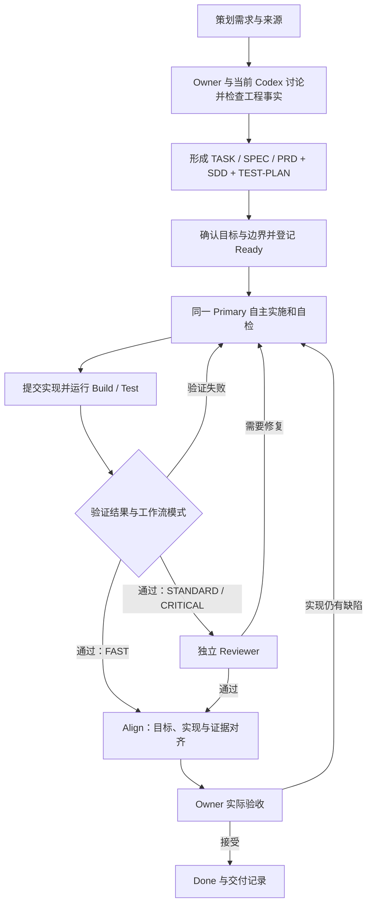

# 完整研发流程：从需求讨论到代码交付

策划提出需求，Owner 与当前原生 Codex 讨论，形成足够清晰的工程文档；同一个 Primary Codex 自主实施，Harness 提供执行反馈与记录，最后通过验证、审查、目标对齐和真实验收完成交付。Web 按需展示进度与证据，Change Lens 辅助理解变化。

本文是完整流程与文件关系的主说明。首次启动见 [README](../README.md)，简表见 [WORKFLOW](../WORKFLOW.md)，逐项命令见 [CLI 参考](CODEX_DIRECT.md)。适用当前 Codex Direct 模式；旧 Web Fusion 的 Agent 顺序与恢复语义不适用于本文。

## 设计原则：模型自主，Harness 保持轻量

让模型自主组织工程工作，让 Harness 提供必要的上下文衔接、工具入口、真实反馈、记录和权限边界。随着模型能力变化，重新检验流程组件的价值；只为反复出现且代价明确的问题增加专门约束。

- **明确结果，允许调整做法。** 讨论确认目标、范围、关键决定与验证预期；读文件顺序、普通实现细节、任务拆解和测试时机由 Primary 根据事实判断。
- **文档最小充分。** 按需使用 SOP、模板与成熟案例；简单任务不扩成完整文档包，不为了填表发明风险、接口或检查项。
- **保留反馈，减少手续。** 构建、测试与实际运行结果帮助模型修正实现。减少重复报告、没有新信息的重验和逐步人工确认，不把失败或未验证写成成功。
- **检查与任务相称。** 注释质量、测试充分性和设计一致性先作为工程指导与交付检查内容；不因此新增独立报告、统一覆盖率门槛或新的强制 Gate。
- **用实际收益决定复杂度。** 关注 Owner 介入次数、总耗时、返工、交付后缺陷与 Reviewer 有效发现。新模型上线后逐项评估可删减的辅助机制，不仅凭模型名称推断可靠性。

这些原则不表示运行规则已被自动改写。本次文档不新增或取消程序门禁：当前 FAST 不启动 Reviewer，STANDARD/CRITICAL 仍执行独立 Reviewer；新任务仍有 document、agree、align 和实际 Owner 验收。未来若调整检查强度，应通过实际任务结果评估并另行修改实现，不能在执行时悄悄跳过现有要求。

## 角色与完整链路

| 参与方 | 负责什么 |
|---|---|
| 策划 / 需求方 | 提供需求来源、预期业务行为和必要背景 |
| Owner | 与 Codex 澄清意图，决定业务取舍与授权范围，最终验收 |
| 当前 Primary Codex | 检查事实、维护讨论结论、自主实施、自检、修复、整理交付依据 |
| Harness | 登记约定与版本，执行配置的检查，保存证据和历史，支持阻塞后的恢复 |
| 独立 Reviewer | 在需要审查的模式下，只读检查实际源码与证据，提出可操作的问题 |
| Web / Change Lens | 可选展示阶段、历史、证据与变化解释 |

图中是正常推进与缺陷返工路径。需求或关键契约变化回到讨论；环境故障进入阻塞与恢复。阶段用来说明工作到了哪里，不要求 Owner 在每一框手动操作，也不规定 Primary 每次搜索或编辑的顺序。

## 需求与讨论会留下什么

原始输入可以是策划文档、Issue、截图或 Owner 的描述。先核对相关代码、配置、接口和已有测试，能从工程获得的信息由 Codex 自行检查；只就影响业务目标、范围或风险接受的未知项向 Owner 提问。

| 讨论内容 | 应保留的信息 |
|---|---|
| 需求来源 | 原始引用、版本或日期；不能访问的来源明确说明 |
| Context | 当前行为、相关代码和限制，以及每项观察的依据 |
| Goal / Acceptance | 要达到的结果，及可观察、可验证的 AC-01、AC-02 等验收条件 |
| Non-goals / Boundary | 本轮不做的内容、允许修改的范围与限制 |
| Design / Key Decisions | 关键设计、选择理由；重要时说明替代方案和取舍 |
| Increments | 有助于实施的行为拆解与验证安排，不预先锁死所有技术细节 |
| Verification / Checks | 准备如何验证验收项，哪些需要自动检查或真实人工确认 |
| Unresolved | 尚未确认的问题，不把猜测写成已获批准的决定 |

参考成熟案例时，记录来源、采用理由和适用限制，不以“先进”为由扩展需求。独立的 ares-ai-software-engineering 知识仓库仅在 Owner 指定时使用，不自动加载。

| 文档等级 | 讨论后的工程文件 | 实施结束后的汇总 |
|---|---|---|
| L1：小改动 | TASK.md，集中记录必要内容 | 在原 TASK 中追加交付与 Align |
| L2：一般功能 | SPEC.md，记录需求、上下文、关键设计和验证安排 | 在原 SPEC 中追加交付与 Align |
| L3：复杂功能 | PRD.md 管需求；SDD.md 管设计；TEST-PLAN.md 管验证方案 | DELIVERY.md 汇总实施、验证、偏移与交付决定 |

重大、长期或难逆的决定才另写 ADR，CLI 不会自动为每个任务生成 ADR。Context、计划与讨论结论进入相应等级的工程文档，不自动另建 CONTEXT.md、PLAN.md、TASKS.md 或任务专属 AGENTS.md，也不自动导出原生完整聊天记录。重要结论和理由应进入文件；原始来源通常保留引用，不默认全文复制。

当前生成器把结构化 Brief 渲染为 Markdown，覆盖最低共同结构。文件存在不代表领域设计已经充分；Primary 按实际需求和适用模板补充内容。领域规则参考 [Ares 集成规则](../workflow/ARES_PROFILE.md) 与 [SOP](../workflow/SOP.md)，无需机械复制全部模板章节。

### 把模糊需求变成可决定的问题

以下收藏功能是**虚构教学示例，未实现、未运行**，用于说明讨论写法。不要把给定情境当成真实项目事实或 Owner 授权。

原始请求：“手机和电脑都能同步收藏，不能把我刚才的选择弄丢。”先查身份、收藏读写入口、存储约束、版本字段及相邻测试，再区分几种解读：

| 需要澄清的行为 | 方案与代价 | 写入现有文档的位置 |
|---|---|---|
| 另一设备何时看到变化 | 重新进入时读取共享状态，或保持页面实时更新；后者增加通知与断线恢复成本 | Acceptance、Non-goals |
| 两台设备基于旧状态先后修改 | 接受最后提交覆盖较简单；拒绝过期版本写入能暴露冲突，但用户需重读后再次选择 | Key Decisions、Design |
| 保存超时该显示什么 | 若提交已成功但响应丢失，不能直接显示“保存失败”；需要既有协议支持核实同一操作 | Acceptance、Verification |
| 下个版本的列表如何排序 | 如果列表已明确不在本轮，记录为后续事项；不要让它变成本轮暗含需求 | Non-goals 与已有任务中的后续事项 |

有价值的提问是：“手机刚收藏成功，电脑按旧状态提交取消，应直接覆盖，还是提示冲突？”同时说明推荐方案、依据和代价。接口是否存在由 Primary 查证，业务选择由实际需求方决定；不把实现者的猜测写成已确认结论。

当前增量的目标、边界、主要失败行为和验证方法已经明确，关键决定及授权齐备，即可进入下一步；不要求固定提问轮数。当前 Ready 要求 `Unresolved` 为空：本轮关键问题须真正解决；已明确排除的未来事项留在 Non-goals 和后续记录中，不为了通过 Ready 删除未决问题，也不把相同决定重复交给 Owner 确认。

### 在同一份 SPEC 中连接验收与工作

继续上述示例，假定需求方**在教学情境中**选择“重新进入读取共享状态；拒绝过期版本写入；不做实时推送和离线队列”。实际采用前先核对这些前提。一般功能仍用一份 L2 SPEC；下表是其中的一段写法，不是必须增加的文件或机器字段。

| 验收行为 | 关键设计与前提 | 实施增量和验证安排 |
|---|---|---|
| AC-01：成功保存后重新进入能读到当前账户的权威状态 | 复用可信身份和读写入口；另一设备后续成功修改可以改变当前状态 | 串起保存、重进页面与读取；观察界面和实际存储，不能只看响应码 |
| AC-02：过期版本的不同操作不覆盖新状态，提示冲突 | 服务端原子比较版本并写入；所有写入入口遵守条件。若现有接口不支持，先补设计与兼容决定 | 先使手机提交，再释放电脑旧版本请求；同时核对拒绝结果、资源值和版本 |
| AC-03：不能读写其他账户收藏或操作结果 | 新增版本参数不代替服务端身份验证 | 直接发起越权读写与查询；确认拒绝且他人数据不变 |

同一操作的安全重试与不同操作之间的冲突是两个问题；不能凭“接口幂等”推断不会覆盖新意图。兼容性也要明确：若旧客户端仍能无条件写入，AC-02 就无法保证；拒绝旧客户端写入或分阶段迁移各有成本，不能在实施中悄悄选择。

每条 AC 要能找到相应设计、工作增量与检查；支撑性任务说明服务于哪项行为或项目约束。这里的表格、AC 标号及 `Checks` 映射只组织信息，尚未产生任何通过结果。实施前核对引用的路径、接口和依赖确实存在；实施后仍需当前证据和真实验收。具体数据契约按项目维护唯一权威定义，不将本例变成通用收藏协议。

## 文件如何指导 Codex 实施

实施依据由三层组成：目标项目的 AGENTS.md 与工程规范规定项目边界；本仓库 SOP 提供适用的方法；当前任务文档与冻结约定明确这次要交付什么。Primary 在原生会话中理解并使用它们，Harness 不将文档层层转译成一个新的实现 Agent。

| 载体 | 谁使用 | 实际用途 |
|---|---|---|
| 项目规则、适用 SOP 与任务工程文档 | 当前 Primary；Reviewer 使用相关文档与上下文 | 理解事实、设计、边界和验收预期 |
| Codex 准备的任务局部 JSON 请求 | CLI / Harness | 登记 Brief、授权、提交说明或对齐结果；不是第二套需求 |
| 数据库中的文档记录与 Agreement | Harness | 保存版本、冻结意图、项目基线、检查方式与真实授权 |
| Harness 组装的 Reviewer 输入 | 独立 Reviewer | 提供约定、讨论文档、提交说明、源码差异与已有验证结果 |

`agree` 冻结 Goal、Acceptance、Non-goals、Boundary、Key Decisions、Verification，并关联文档版本、项目策略、基线和构建/测试命令。当前要求无未解决问题，每条 AC 有自动或人工验证映射。Owner 已表达的授权由 Codex 登记，不要求到 Web 再填一遍。

`begin` 登记实施阶段；它不启动新的 Primary。当前 Codex 自主搜索、编辑、运行相关验证并根据反馈修正代码。Harness 不自建 Agent Runtime、Session Runtime、Search/Edit/Shell/Sandbox，不在 Ready 后重启 Grounding 或 Planner Agent。

普通实现细节调整写入实施说明和交付对齐；影响目标、边界、关键设计或契约的变化重新协调约定。需要改变冻结文档时使用版本流程，不能直接改 Markdown 后沿用旧授权。

## 使用顺序与产物

| 顺序 | CLI 操作 | 产物 |
|---|---|---|
| 讨论 | project → create → document | 原始来源、上下文、决定与 TASK/SPEC/正式文档包 |
| Ready | agree → begin | 文档版本、冻结约定与实际授权 |
| 实施 | 按行为增量修改及验证 → submit | 项目改动、提交说明与源码指纹 |
| 验证 | verify；缺陷后 begin → 修复 → submit → verify | 构建、测试、独立审查及历次证据 |
| 对齐 | align | L1/L2 更新 TASK/SPEC；L3 生成 DELIVERY |
| 理解变化 | 可选 lens | 分析与解释 JSON、离线 HTML |
| 验收 | 实际 Owner 接受后 accept | 验收决定；不自动 push/merge/release |

上述 CLI 操作由 Codex 维护，Owner 主要参与需求讨论、实质性决定与验收。流程描述不是要求增加相同数量的人工批准。

## 实施、自检与独立审查

实施交付包括实际代码、必要的配置与文档更新、适用的测试代码，以及 Primary 对改动和限制的说明。注释与测试是工程工作的一部分，不为证明执行了某个步骤而制造无价值产物。

### 代码与注释

[交付检查表](../workflow/templates/DELIVERY-CHECKLIST.md) 要求注释解释原因和约束，不重复代码表面行为。重点检查不直观的业务规则、特殊分支、顺序与生命周期约束、兼容处理及必要接口副作用，同时清理过期注释、临时日志和废弃逻辑。简单直观的代码无需逐行翻译。

Primary 在实施与清理时判断这些内容，Reviewer 结合实际改动检查可维护性。当前没有独立的注释质量评分或必填审查字段，不承诺每次都已全面审查注释。重要检查结果可放入已有 TASK/SPEC/DELIVERY 的交付部分，不新建 COMMENTS_REPORT，也不设置注释数量门槛。

### 测试的选择与实际执行

Primary 根据改动行为和主要风险选择验证方法。适用时覆盖正常、边界、非法输入、重复操作、超时、失败恢复和兼容场景；涉及跨模块或用户操作的功能，再选择集成、端到端或人工验证。核心规则和缺陷适合时优先测试驱动，不为低影响文字修改增加镜像实现的测试。参考 [测试方案模板](../workflow/templates/TEST-PLAN.md)，无需每项任务都执行所有测试层级。

当前 `verify` 的 Test 节点依次执行项目配置的 BuildCommand、TestCommand，记录输出与进程结果。构建失败时停止，不能把未运行的测试说成通过。非零退出、超时、取消或执行故障不会算成功；依赖服务等环境问题应保留真实失败原因。

| 当前能检查的事实 | 不能仅由 Test PASS 推出的结论 |
|---|---|
| 配置命令成功结束并保存结果 | 确实发现了足够测试、测试断言有效 |
| 本轮验证证据可定位 | 每个业务场景都已覆盖 |
| AC 已映射到 build/test 或人工方法 | 每条 AC 已绑定并通过具体测试用例 |
| 原始证据与提交源码保持关联 | 线上体验、兼容性和所有异常路径都正确 |

当前自动 AC 映射主要到 build/test 命令级别，没有通用的测试数量、覆盖率或测试充分性门禁。轻量做法是让 Primary 说明“验证了哪些行为、实际结果、仍未验证什么”，由审查及验收评估是否足以支持交付。关键验证缺口不能隐藏，增加表格或 Gate 本身不构成验证。

### Reviewer 与返工

| 模式 | 当前提交后行为 |
|---|---|
| FAST | Build/Test → Align → Owner 验收；不启动 Reviewer |
| STANDARD | Build/Test → 独立 Reviewer → Align → Owner 验收 |
| CRITICAL | 提交后同 STANDARD；实施前另有冻结写入边界的明确授权 |

L1/L2/L3 决定文档深度，与以上模式不一一对应。SOP 的 Build 指设计确认，工具 build 指构建检查。

Reviewer 使用独立只读会话，核对实际源码、差异、讨论文档与验证证据，返回 PASS 或 REWORK_REQUIRED；问题包含严重性、相关要求、依据和修复建议。它也可能遗漏问题，不能把模型审查解释为完整性证明。当前上下文包含有长度限制的文档和报告摘录，也不等于自动穷尽所有资料。

缺陷交给当前 Primary，按 `begin → 修复 → submit → verify` 重新检查，每次 verify 建立新 Run。环境故障且源码未变可重试 verify；目标或关键契约变化返回讨论、更新文档并重新 agree。恢复细节见后文，不新增替代 Primary 或专用 Rework Agent。

## 如何判断完成目标

完成判断需要可理解的目标、对应实现、真实验证结果和 Owner 的实际接受。Align 把这些内容在已有交付文档中对齐，无需另外增加一套逐阶段审批。

例如，下面是交付说明的写法示意，**不是本项目已执行的测试记录**：

| 验收条件 | 实现与验证说明 | 实际交付时应填写 |
|---|---|---|
| AC-01：合法输入得到预期结果 | 对应实现位置、适用测试与当前 Run 证据 | 真实结果及证据引用 |
| AC-02：非法输入被拒绝 | 边界/异常行为及其验证 | 真实结果或明确缺口 |
| AC-03：操作提示符合需求 | 实际 UI 检查或人工确认来源 | 已确认事实；未检查则如实说明 |

当前 Align 要求每条 AC 有结果记录；自动项关联当前成功测试节点的匹配 build/test artifact，人工项记录真实 Owner 确认。还记录设计符合情况、偏移、清理和遗留。L1/L2 追加原文档，L3 汇总到 DELIVERY。

Harness 检查本轮运行完成、源码仍匹配提交、文档与验证证据未变化、证据属于对应成功节点等。它不根据非空说明证明语义正确，也不自动判断所有断言是否充分；这部分由 Primary 如实组织，Reviewer 和 Owner 判断。当前模型并不因为具有更强能力就能替 Owner 决定未表达的业务取舍。

测试失败、阻断缺陷或重要验证缺口尚未解决时，不应宣称完成。当前新任务需要完成 Align、无未解决冲突并记录真实验收后才能 accept；不能把实施授权、自动节点通过或 GitHub CI 成功当成 Owner 验收。非阻断限制也需在交付说明中明确，由 Owner 理解后决定是否接受。

GitHub 提交、合并与发布遵循各自实际授权，业务 Done 不会自动触发这些动作。远程只保留可提交的工程内容与安全摘要，见 [GitHub 协作规范](GITHUB_WORKFLOW.md)。

## 文件与记录放在哪里

| 产物 | 当前位置或载体 | 用途 |
|---|---|---|
| 代码、配置、测试代码及项目文档 | 已授权目标仓库 | 实际交付内容 |
| TASK / SPEC / PRD / SDD / TEST-PLAN / DELIVERY | DocumentsRoot 下的任务版本目录 | 人可读的需求、设计与交付结论 |
| Brief、Agreement、授权、提交说明、Align、验收及历史 | DataRoot/ares-workbench.db | 结构化状态与版本关联，不是额外逐份生成的 Markdown |
| build-*.txt/.json、test-*.txt/.json | DataRoot/artifacts/&lt;run-id&gt;/ | 实际命令、输出与进程结果 |
| Reviewer 结构化结果、报告与运行记录 | 同一 Run 的 artifacts 目录 | 独立审查结论、发现及原始执行记录 |
| final.diff.patch、运行级 delivery.md | 同一 Run 的 artifacts 目录 | 该轮差异与执行摘要，不替代工程文档中的 Align |
| CLI JSON 输入、构建中间物和缓存 | 任务专属 ScratchRoot 子目录 | 可再生产物，不上传到业务仓库 |

DocumentsRoot 下当前使用 `TASK-<task-id>/v<version>-<id>/` 保存版本；Agreement 保留当时冻结文本。具体根目录取决于本地配置。当前 Windows 工作区要求过程产物在授权的 D:/AgentWorkspace 目录，不能写入 C: 或商业目标项目。

本文件属于可随仓库版本维护的流程说明，放在 docs/；本机任务讨论、认证、SQLite 和原始 artifacts/evidence 不因此上传。Web 读取现有记录，不让 Owner 重复填写；它展示已登记的阶段与证据，不宣称掌握原生 Codex 的每次工具调用。

## 一次性配置

复制 scripts/workbench.example.json 到仓库外的本地配置，保留已有 DataRoot、ScratchRoot、CodexHome、dotnet/git 路径，补充：

- DocumentsRoot：文档根目录，默认 D:/AgentWorkspace/Ares/10_WORK/active。
- PythonExecutable：现有 Python 3.11+ 的绝对路径。
- ChangeLensRoot：本仓库 tools/change-lens 的绝对路径。
- ChangeLensWorker：ScratchRoot/lens-build/bin/ChangeLens.Analyzer/release/ChangeLens.Analyzer.dll。

认证、数据库、缓存和构建输出均放在授权 D:/AgentWorkspace 目录。使用已配置的官方 CLI home，不把认证放进项目。Worker 基于 net8.0，集成调用允许使用已安装的更新 .NET 主版本。

~~~powershell
./scripts/Ares.ps1 -SettingsFile '<absolute-local-settings.json>' -Operation projects -Build -BuildLens
~~~

Change Lens 正常调用无需 pip 安装；契约测试另需 jsonschema 和 PyYAML。其原 MIT 许可保留，主项目与 SOP 仍为私有内容。

## Codex 的结构化输入

所有写操作使用最新 Revision。JSON 由 Codex 根据真实讨论准备，Owner 不直接操作。document 输入：

~~~json
{
  "TaskId": "<task-id>",
  "Revision": 0,
  "Brief": {
    "Level": "L2",
    "LevelReason": "可独立验证的局部行为",
    "Source": "策划需求的真实引用 @ 版本",
    "Context": [{"Observation":"当前行为和约束","Source":"检查过的文件或证据"}],
    "Anchors": {
      "Goal":"预期结果",
      "Acceptance":["可观察验收项"],
      "NonGoals":"本轮不做",
      "Boundary":"授权边界",
      "KeyDecisions":"确认的方案和理由",
      "Verification":"构建、测试、人工验证方法",
      "Unresolved":[]
    },
    "Checks":[{"Criterion":1,"Kind":"automatic","Method":"test"}],
    "Design":"关键设计、数据与流程；适用时说明失败、兼容、回滚和取舍",
    "Increments":["可独立验证的行为与验证方式"]
  }
}
~~~

agree 只需 TaskId、Revision、实际 Owner Quote/Source，省略 Anchors/Checks 时从 Brief 读取。准备文档不等于授权。

align 的 Alignment 字段示例：

~~~json
{
  "Criteria":[{"Criterion":1,"Result":"实际验收结果","ArtifactIds":["<current-run-test-artifact-id>"]}],
  "DesignConformance":"实现与设计、契约的实际核对",
  "Deviations":"已解决的偏移或无偏移的说明",
  "Cleanup":"清理结果与遗留",
  "Unresolved":[]
}
~~~

status 返回任务、运行、事件、artifact ID 和审批。人工项另传 ManualConfirmation（真实 Quote/Source），ArtifactIds 可为空。不得引用其他 Run 或把任意报告当作成功测试。Harness 校验证据归属、成功节点和哈希，Primary 的逐项判断仍需 Reviewer/Owner 评估。

## 文档版本与恢复

新 CLI 任务要求文档和 Align；旧记录保留兼容行为。新增版本写入 DocumentsRoot/TASK-<task-id>/v<version>-<id>/；Agreement 保留冻结文本。L1/L2 交付追加在同一文档，L3 DELIVERY 单独汇总，不重复生成实施报告。

文件发生变化会阻止相关操作。重新协调后 reopen → document → agree，旧版本保留。源码变化使用现有指纹保护，证据变化也会阻止 Align/accept。

### 需求改变后怎样更新约定和证据

先将反馈定位到当前约定，区分修复缺陷和改变目标。可以在原任务简记“旧约定 → 新要求 → 原因/实际授权 → 受影响 AC、设计和检查”，不必另建变更审批表。

| 实际情况 | 按已有流程处理 | 对证据的影响 |
|---|---|---|
| 当前 AC 已要求失败提示，实现却遗漏 | 原约定下返工；已返回 Rework 的任务 `begin → 修复 → submit → verify`；Owner 新报缺陷先用 `feedback` 记录 | 修正后取得新 Run 并重新 Align，不借修订 AC 掩盖缺陷 |
| 原来只允许单设备，现要求两台设备同时修改 | 核实范围、冲突和兼容选择及真实授权，`reopen → document → agree` 后实施 | 旧单设备测试不能证明多设备语义；更新验收及测试安排，原版本保留 |
| 只调整普通实现细节，没有改变冻结的目标或关键设计 | 在实施说明和 Align 记录；若已经提交则走相应返工和重新提交 | 运行项目必跑项及受影响检查，不能沿用已失效的源码指纹 |
| 验证环境故障且提交源码未变 | 核对故障、残留进程与当前状态后重试 `verify` | 保留失败记录；新的实际结果才可支持继续 |

完整操作字段与允许状态以 [CLI 参考](CODEX_DIRECT.md) 为准，每次操作使用最新 Revision。上表解释已有分支，不授权跳过文档、风险审查或验收。冻结文件发生变化要重新协调；普通实施说明不能成为暗改冻结文件的理由。

**变更推演（未执行）**：原约定限定单设备；新约定加入上述 AC-02。手机与电脑都读到资源版本 10，手机先收藏成功成为版本 11，再到达的电脑取消请求仍基于版本 10。若已选择拒绝过期写入，预期电脑收到冲突且资源仍保持手机提交的值。电脑重读后，只有用户再次表达取消意图才提交新操作；自动替它换版本重试会掩盖冲突。版本号是教学符号。

按影响检查：修订原成功显示与恢复行为；补服务端条件写入、客户端冲突提示和用户再次选择；复核新增入口的账户隔离；检查旧客户端组合；保留原功能回归和项目必跑项。测试需要区分“先读版本再无条件写入”的错误实现，检查和写入分离会留下并发窗口。可控替身只能证明自身覆盖的路径，不能证明真实数据库原子性。

`agree` 的每项 `Checks` 与 Align 的 `Criterion` 都按当前验收顺序关联。删除、拆分或重排 AC 后，检查编号与方法一同重核；旧 AC-02 的文字和结果不能直接贴到新的第二项。自动项在 Align 中引用当前成功 Run 的匹配 build/test artifact，人工项保留真实确认来源。旧证据可以解释历史、帮助诊断，不能伪装成新约定已经通过。

交付写法示意：“本次把单设备约束修订为多设备冲突规则，补充并发、身份与兼容检查；实际通过的项目和未验证项分别列出。”本例没有实际运行，不能将它复制成成功记录。只有当前证据齐备并取得 Owner 实际接受后才 `accept`，重新确认方案不等于最终验收。

关闭 Web 不影响 CLI；硬崩溃先核对残留进程，再 recover 和重验，不承诺会话透明接管或重放。

## Change Lens 与 Web

lens 请求增加 UnityPath、Assembly、AllowSyntaxPartial（默认 false）。它使用冻结 Git HEAD → 提交 WORKTREE，可能包含 Ready 前已有未提交修改，报告明确说明比较范围。

严格历史编译基线缺失时保留 FAILED；任务明确允许时传 AllowSyntaxPartial=true，结果标为 PARTIAL。不会替目标项目生成编译清单或执行 Unity。分析前后核对源码，变化时拒绝挂接。

输出在 DataRoot/artifacts/<run>/lens/<attempt>/。来源输入使用现有 intent-evidence schema，task/run/source 关联由 Harness 保存。报告的验证步骤只是建议，不改变测试或审批。

Observer 展示讨论文档、阶段、对齐结果、实际证据与变化报告。文档/报告被更改返回 409；报告绑定检查快照，不宣称实时监控外部编辑。网页不是任务执行入口。

## 文档适用范围

当前说明与 [工作流概览](../WORKFLOW.md)、[CLI 操作表](CODEX_DIRECT.md) 对齐。旧 Web Fusion、Phase 1 契约和上游来源各自标明适用范围；导航见 [文档索引](README.md)。GitHub 记录使用 [协作规范](GITHUB_WORKFLOW.md) 和仓库模板，不把原始过程文件上传。

## 来源与验证

[导入清单](integrations/UPSTREAM_IMPORTS.json) 保留原仓库、固定 commit 和原文件哈希。导入采用源码快照，历史可从固定来源追溯；不是将旧提交伪造成当前开发记录。

现有 Test-Workbench.ps1 覆盖兼容及文档/Align 约束；导入分析器保留 unittest。原生 Reviewer 和 UI 另用隔离真实样例验证。知识库未接入，仅 Owner 指定时手动参考。

本页的澄清与变更示例按 Owner 指定参考知识库 [RR-025：需求澄清、规格变更与当前验收](https://github.com/YIMO691/ares-ai-software-engineering/blob/ca9c74c0c8e2ed5ea02fcd1daeb2495d5ed03584/03_REFERENCE_RESEARCH/09_CROSS_RESEARCH/RR-025_SPEC_CLARIFICATION_AND_CHANGE.md)（固定版本，研究状态 PROPOSED）。采用其行为分歧、依赖核对与证据边界的解释，具体操作仍按本仓库规则。研究不是本项目的产品验证；引用不启用自动知识加载，也不引入新的审批或运行机制。

## 统一验证入口

在已授权的外部目录运行 scripts/Test-Unified.ps1 -ScratchRoot <path> -EvidenceRoot <path> -InstallTestDependencies。该入口依次执行 Harness 回归、SOP 文档检查、Roslyn 构建与 Change Lens 测试；不会启用真实 Unity 项目测试。首次需要安装的 Python 测试依赖写入 ScratchRoot/python-libs。GitHub CI 使用同一入口，远程结果需实际运行后才能确认。
