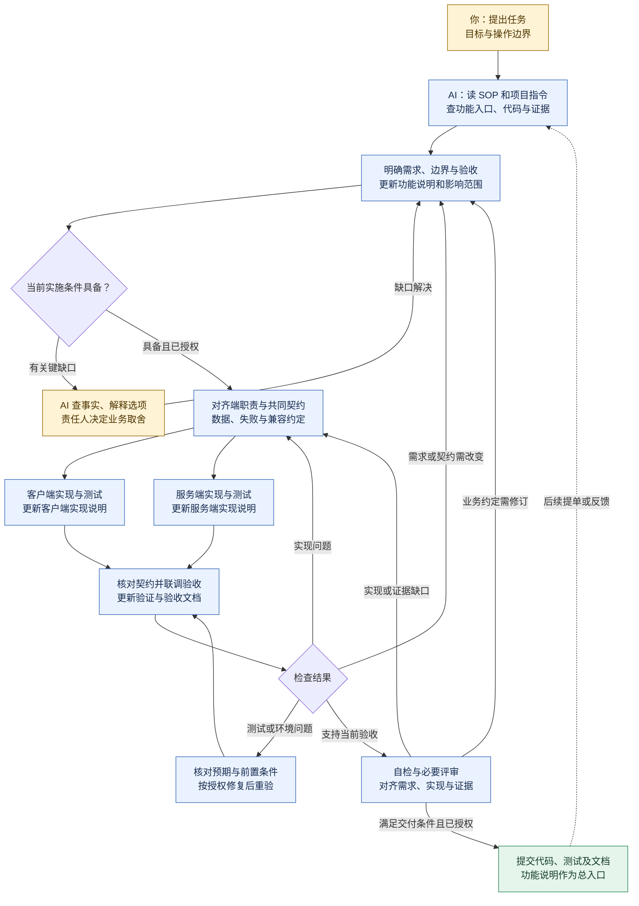

# Workflow-SOP

把这个仓库和任务交给 AI，让它按项目现状完成开发、验证和文档更新。后续修改从功能文档进入，能找到原需求、两端实现与验证依据。

**本仓库提供可按需取用的工作流思路：结合任务和个人习惯裁剪，无须完整执行每个步骤；以完成任务、提交代码及与实际实现和验证结果一致的必要文档为目标。**

## Ares 集成入口

此目录导入 Workflow-SOP 固定版本，提供可裁剪的方法、模板与例子。在 Ares 中以 [现行流程](../docs/UNIFIED_WORKFLOW.md)为日常入口，本页的通用方法、模板与案例按需参考；根 [AGENTS.md](../AGENTS.md) 是仓库维护指令入口。[版本与适配记录](../docs/integrations/LOCAL_ADAPTATIONS.md) 说明来源和兼容边界。

## 从这里开始

在能访问目标项目的 AI 会话中发送：

```text
请读取 https://github.com/YIMO691/Workflow-SOP 的 README 和 docs/WORKFLOW.md，按指南完成任务。
先检查目标项目指令、代码和已有功能文档，说明本次影响的需求、客户端、服务端及验证。
实施过程中更新受影响的文档，最后给出功能入口、改动、实际验证结果和未完成项。
任务：<描述要解决的问题，或提供已有提单>
```

有特殊操作边界时一并说明。首次使用无须安装技能或部署服务；资料读不到时由 AI 说明缺口，取得获准读取的内容后继续。

## 完成后提交什么

**双端新功能：代码及相关测试 + 功能说明、客户端实现、服务端实现、验证与验收这四类文档。** 已有对应记录就沿用原文件与格式，后续修改只更新受影响的部分。

以收藏功能为例，提交到目标项目已有文档位置：

```text
收藏功能-功能说明.md        ← 总入口：为什么做、规则、完整链路、相关文档
收藏功能-客户端实现.md    ← 界面、状态、交互、请求和恢复、代码入口
收藏功能-服务端实现.md    ← 校验、业务、数据、并发和恢复、代码入口
收藏功能-验证与验收.md    ← 验收场景、实际结果、证据、未验证项
```

文件名是示意，已有分端手册或测试记录可以直接对应；协议、配置定义和自动化测试引用原文件，不复制一套。**功能说明是后来的人和 AI 的第一阅读入口。** 具体写法见 [四类模板](templates/README.md) 和 [关联示例](examples/L2-standard-feature.md)。

| 这次做的工作 | 文档怎样交付 |
|---|---|
| 新的客户端与服务端功能 | 建立或补齐上述四类记录，并相互链接 |
| 扩展或修改已有功能 | 从功能入口梳理影响，更新受影响的需求、端实现和验证；变更记录关联本次提单/提交 |
| 仅一端的功能 | 保留功能说明、涉及端的实现及验证；说明未涉及另一端的依据 |
| 独立小修复 | 原提单或 PR 写目标、改动和验证；影响已有功能说明或设计时同步原文档 |

代码、测试和文档随本次工作提交到**目标项目**，提单或 PR 链接功能入口及证据；无需另写重复的任务、PRD、SDD 或交付报告。项目已有明确交付要求时沿用。

## 整个流程

文档随实施逐步补全。两端分支表示职责与记录，不要求并行 Agent 或分阶段交文档。



仅涉及一端时走相应分支，并核对共同契约是否仍兼容。条件不足只暂停受影响动作；反复失败没有新证据时调整诊断路线。提交、验收与发布分别按项目约定和授权处理，图中的回流不表示无限重试或逐阶段审批。详细条件见 [工作指南](docs/WORKFLOW.md)。

## 给 AI 的执行入口

先读 [工作指南](docs/WORKFLOW.md)，再查目标项目指令、功能入口及相关实现与证据。记录缺失时参考 [模板用法](templates/README.md)；遇到具体问题再查 [工程规则](docs/ENGINEERING_RULES.md)、[技能推荐](skills/README.md) 或 [工具接入](docs/AI_COLLABORATION.md)。上游维护指令保存在 `UPSTREAM-AGENTS.md`，仅供来源参考。

[获取帮助](SUPPORT.md) · [贡献与检查](CONTRIBUTING.md) · [变更记录](CHANGELOG.md) · [来源与历史](docs/SOURCES.md) · [安全说明](SECURITY.md)

团队试行参考，未验证普遍效率收益。私有协作仓库，未选择开源许可证，资料使用遵循原授权。
