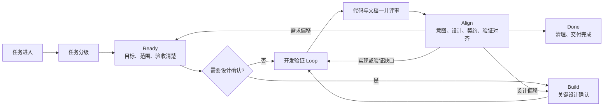

# 轻量研发工作流

版本：v0.4（正式功能模板包试运行稿）

适用范围：新功能、功能迭代、缺陷修复、重构和技术改造

> 当前版本仍处于试运行阶段，并非已经定型的公司最终规范。它尚未在足够多的真实团队、项目类型和工具环境中验证。使用过程中如果发现步骤无效、成本过高、职责重复、描述不清、无法覆盖实际风险，或存在更轻量可靠的做法，请提出改进建议。

## 1. 目的

这套工作流用于让需求意图、关键设计、验证结果和必要的维护信息在开发过程中自然留下来。

它不要求所有任务依次编写 PRD、SDD、测试方案。任务先分级，再选择最低必要产物：

- L1 小改动：任务说明即可。
- L2 标准功能：一份 `SPEC.md`。
- L3 复杂或高风险项目：使用完整正式流程，包含 PRD、SDD、TEST-PLAN、DELIVERY；重大决策才写 ADR。

## 2. 核心原则

1. 任务驱动，文档按需产生。
2. 只记录无法从代码中轻易还原的信息。
3. 统一最低结果，不统一个人思考和表达方式。
4. 文档与代码使用同一个任务和 PR/MR，不增加独立审批流。
5. 需求、设计、测试之间保持轻量关联，不建设复杂追踪系统。
6. 文档可以短，但目标、边界、关键决定和验收标准不能含糊。
7. 权威按信息类型划分；发生偏移必须解决，不能让过期文档或偶然实现自动成为全部真相。

## 3. 工作流总览



开发验证 Loop：

```text
选择最小行为 → 列测试 → Red → Green → Refactor → 回归 → 下一个行为
```

TDD 指 Test-Driven Development，不是一份必须提交的文档。测试代码和测试结果是主要证据。

## 4. 新人与 AI 入口

- 新人从 [START-HERE](START-HERE.md) 开始，不需要先读完所有规范。
- AI 编码工具读取 [AGENTS](UPSTREAM-AGENTS.md) 和 [AI-PLAYBOOK](AI-PLAYBOOK.md)。
- 新任务复制 [NEW-TASK](prompts/NEW-TASK.md)。
- 中断、换人或换 AI 时复制 [CONTINUE-TASK](prompts/CONTINUE-TASK.md)。
- 最终交付复制 [ALIGN-GATE](prompts/ALIGN-GATE.md)。

`UPSTREAM-AGENTS.md` 是自动入口，保持短小；完整的 AI 行为、输出契约、停止条件和证据规则集中放在 `AI-PLAYBOOK.md`，避免多处重复。

## 5. 工作流快速开始

1. 阅读 [任务分级](TASK-LEVELS.md)，选择 L1、L2 或 L3。
2. 复制对应模板：
   - L1：[TASK](templates/TASK.md)
   - L2：[SPEC](templates/SPEC.md)
   - L3：从 [正式功能模板包](templates/FORMAL-FEATURE/README.md) 开始，使用 [PRD](templates/PRD.md)、[SDD](templates/SDD.md)、[TEST-PLAN](templates/TEST-PLAN.md) 和 [DELIVERY](templates/DELIVERY.md)
3. 满足 Ready 后开始实现；高风险任务先满足 Build。
4. L1/L2 在任务或 PR/MR 中完成 [交付检查](templates/DELIVERY-CHECKLIST.md)；L3 在 DELIVERY 中汇总实施、测试、偏移和最终对齐。
5. 只有独立审计需要时才额外使用 [对齐记录](templates/ALIGNMENT-GATE.md)。
6. 重大技术选择单独复制 [ADR](templates/ADR.md)。

完整规则见 [研发 SOP](SOP.md)。

## 6. 文档职责

| 产物 | 回答的问题 | 何时需要 |
| --- | --- | --- |
| TASK | 改什么、为什么、如何验收 | L1 |
| SPEC | 需求、设计、测试如何形成一个完整功能 | L2 默认 |
| PRD | 为什么做、为谁做、做什么 | L3 |
| SDD | 系统如何实现、如何失败和恢复 | L3 或高风险设计 |
| TEST-PLAN | 如何系统验证质量与发布条件 | L3 或复杂测试 |
| ADR | 为什么选择这个关键方案 | 存在重大、长期或难逆决策时 |
| DELIVERY | 最终实现、测试结果、偏移、Align 和交付决定 | L3 正式流程 |
| DELIVERY-CHECKLIST | 是否真正完成并清理干净 | L1/L2，可放在 PR/MR |
| ALIGNMENT-GATE | 独立审计时记录权威来源与交付一致性 | 仅审计要求按需使用 |
| START-HERE | 新人如何在几分钟内启动 AI | 新人首次使用 |
| AGENTS / AI-PLAYBOOK | AI 自动入口与执行协议 | AI 参与分析、设计、实现或评审 |

## 7. 示例

- [L1 缺陷修复](examples/L1-bugfix.md)
- [L2 标准功能](examples/L2-standard-feature.md)
- [L3 复杂功能](examples/L3-complex-feature/README.md)
- [Align Gate 试运行](pilots/DOC-ALIGNMENT-GATE/00-TASK.md)
- [AI 操作层试运行](pilots/AI-OPERATION-LAYER/SPEC.md)

## 8. 分层权威

- TASK/SPEC/PRD：需求目标、范围、业务规则和验收标准。
- SPEC/SDD：关键设计、边界、失败语义和兼容策略。
- ADR：重大选择及其理由。
- 接口定义、Schema、迁移和配置校验：公共契约的机械事实。
- 测试、代码和运行证据：当前实现及线上实际状态。

文档对意图和设计具有规范性权威，但不能替代对代码和运行事实的检查；代码反映当前实现，也不能未经确认自行改变产品意图。完整规则见 SOP 的 Align Gate。

## 9. 维护方式

- 模板与 SOP 一起版本管理。
- 流程问题在实际任务复盘中提出，不为假设场景提前增加章节。
- 新增强制项必须说明它防止了什么真实风险。
- 连续多次无人使用或无法产生价值的字段应删除或降为可选。
- 若任务系统已经维护负责人、状态、评审人等元数据，模板中的重复字段可以删除。

### 如何提出优化建议

不需要单独填写正式提案。在任务评论、复盘或工作流维护记录中说明以下内容即可：

```text
任务类型和等级：
使用到的流程或模板：
遇到的问题：
造成的实际影响：
建议如何调整：
可验证的案例或证据：
```

以下情况尤其值得反馈：

- 同一信息需要在多个地方重复维护。
- 某个字段或 Gate 无法帮助决策、评审、验证或交接。
- 为满足模板而编写了无人使用的内容。
- AI 或新人容易误解流程、选择错误等级或过度生成文档。
- 实际缺陷、返工或事故没有被现有流程发现。
- 某项检查可以由代码、测试、Schema 或自动化工具替代。

改进建议应优先减少重复和无效成本。除法规、安全、审计或已发生风险明确要求外，不因个人偏好增加新的强制文档和审批环节。

## 10. GitHub 协作

- 贡献方式见 [CONTRIBUTING](CONTRIBUTING.md)。
- 使用问题见 [SUPPORT](SUPPORT.md)。
- 敏感问题按 [SECURITY](SECURITY.md) 私密报告。
- 重要版本变化记录在 [CHANGELOG](CHANGELOG.md)。
- 所有 PR 使用仓库模板并运行 `pwsh ./scripts/validate-workflow.ps1`。

当前仓库用于私有内部协作，未附加开源许可证。未经所有者明确授权，不得将内容视为可公开分发或再许可。
