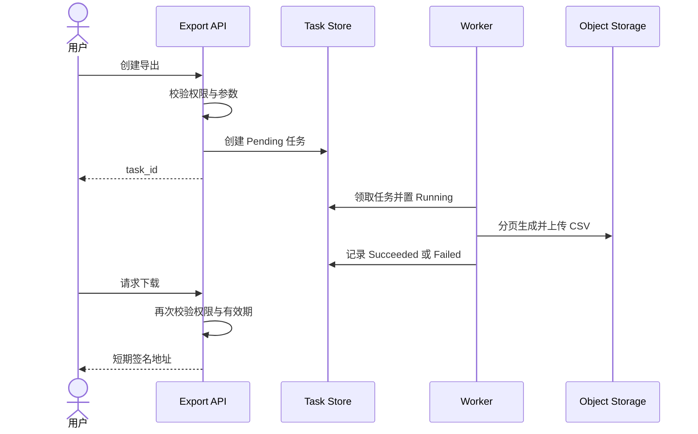

# 1. 设计摘要

API 只负责校验并创建任务；后台执行器领取任务，以分页方式查询有权限的数据并写入对象存储。任务记录是状态权威，下载服务在生成短期地址前再次校验用户权限与文件有效期。

# 2. 当前系统与改动范围

复用现有报表查询、权限判断、任务队列和对象存储客户端。新增导出任务模型、三个 API 和后台执行器，不修改同步预览查询。

# 3. 总体结构与关键流程

# 4. 数据、接口与协议

任务保存 `id、owner_id、report_type、normalized_filter_hash、status、progress、object_key、expires_at、error_code、created_at、updated_at`。状态为 `Pending、Running、Succeeded、Failed、Expired`。

API：创建任务、查询本人任务、获取下载地址。客户端不得直接获得对象存储永久地址。

# 5. 核心规则与状态变化

- 任务领取使用条件更新，保证同一任务只有一个执行器成功进入 Running。
- 相同用户、报表和规范化筛选在 10 秒去重窗口内复用未完成任务。
- 执行器只使用任务所有者身份读取数据，不使用无约束系统身份。
- `Succeeded` 必须同时具备对象键、行数和到期时间。
- 下载时重新校验当前权限；撤权优先于历史任务成功状态。

# 6. 失败处理与可恢复性

- 执行器失联后由租约超时恢复为 Pending，最多自动重试两次。
- 参数、权限或数据规则错误直接 Failed，不自动重试。
- 上传成功但状态提交失败时，以任务 ID 作为固定对象键重试提交，避免产生多个文件。
- 清理任务将过期文件删除并把状态置为 Expired；删除失败记录告警并继续重试。

# 7. 兼容、迁移与发布

新表和新 API 不影响同步预览。入口由功能开关控制；回滚应用前先停止创建新任务，等待或终止正在执行的任务。任务表无需回填历史数据。

# 8. 性能、安全、日志与监控

- 分页读取和流式写入，单任务不在内存保留完整结果。
- 限制单用户并发数、最大行数和执行时长。
- 日志记录任务 ID、报表类型、状态变化和错误类别，不记录导出内容。
- 监控排队时长、执行时长、失败率、重试率、过期清理失败和存储用量。

# 9. 关键决策与替代方案

采用异步任务而非延长同步请求，见 [ADR-0001](adr/0001-use-async-export-job.md)。

# 10. 实施拆分

1. 任务模型、状态机和领域测试。
2. 创建/查询 API 与权限测试。
3. 执行器、对象存储与失败恢复。
4. 导出中心 UI、下载和端到端验证。
5. 监控、容量限制、开关与发布演练。

# 11. 验证方式

执行 [TEST-PLAN](TEST-PLAN.md)，重点验证权限、幂等、执行器失联、对象上传边界和过期清理。
